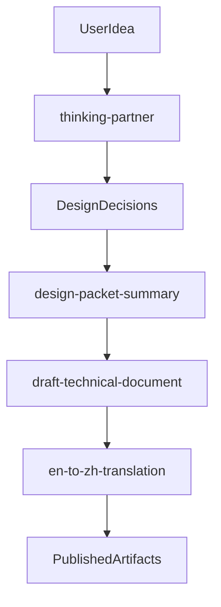
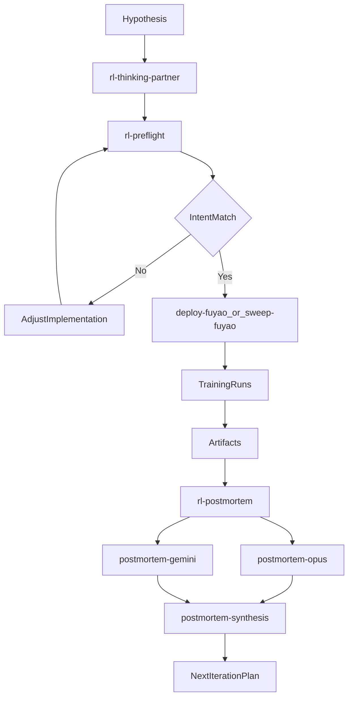

# Shareable Cursor Toolbox

A portable toolbox for structured thinking, RL experiment execution, postmortem analysis, and technical documentation.

## Installation

1. Open a terminal in this folder.
2. Run: bash install.sh
3. Answer the prompts for destination paths and aliases.
4. The installer copies assets into your Cursor config root.
5. Existing destination files are backed up with timestamped .bak suffixes.

Installer prompts:
- Cursor config root
- Draft technical document output directory
- Draft technical document TOC script path
- Understand-document output directory
- Design-packet base directory
- Postmortem report root
- Postmortem output directory
- Cluster SSH alias
- Remote alias for remote artifact pulls

## Uninstall

1. Remove installed files from your Cursor config root.
2. Restore any desired .bak timestamped backups.
3. Optional: remove this package folder after uninstall.

## Workflows

### Documentation Path

Purpose:
- Transform a rough idea into publishable technical documentation.
- Preserve design reasoning in a reusable, auditable format.
- Support bilingual output when needed.

Skill chain:
- thinking-partner: challenge assumptions and sharpen design choices.
- design-packet-summary: distill chat decisions into structured handoff packet.
- draft-technical-document: produce a table-first implementation document.
- en-to-zh-translation: produce Simplified Chinese version.

### Experiment Path for RL

Purpose:
- Move from experiment hypothesis to verified implementation.
- Dispatch training in deterministic deploy and sweep flows.
- Close the loop with postmortem diagnosis and iteration planning.

Skill chain:
- rl-thinking-partner: define hypothesis and expected behavior.
- rl-preflight: verify code matches the hypothesis.
- deploy-fuyao: launch a single controlled training job.
- sweep-fuyao: launch and verify multi-combo hyperparameter jobs.
- rl-postmortem: digest artifacts and generate diagnosis report.
- postmortem-opus plus postmortem-gemini plus postmortem-synthesis: independent analyses and merged verdict.

Deploy and sweep architecture reference:
- docs/cursor-deploy-command-flow.md

Script sets working together:
- deploy set: deploy_fuyao_sweep_dispatcher plus deploy_fuyao plus verify_fuyao_jobs.
- postmortem set: report_assembler plus postmortem_charts plus generate_video_manifest plus postmortem_digest.

## Skill Inventory and Purpose

- thinking-partner: general Socratic thinking and decision stress-test.
- rl-thinking-partner: RL-specific hypothesis and failure-mode planning.
- rl-preflight: intent versus implementation verification before runs.
- rl-postmortem: artifact-driven RL diagnosis after runs.
- design-packet-summary: convert chat into a reusable design packet.
- draft-technical-document: generate concise technical documents from decisions.
- en-to-zh-translation: convert English technical docs to Simplified Chinese.
- understand-document: structured comprehension output for provided documents.
- deploy-fuyao: deterministic single-run remote deployment workflow.
- sweep-fuyao: deterministic sweep dispatch and verification workflow.

## Included Assets

- skills: 10
- rules: 7
- commands: 6
- templates: 3
- agents: 1
- scripts: 8
- docs: 1

## Usage Notes

- Skills can be invoked directly in chat using their names.
- Commands can be invoked with slash command form when installed.
- plan-action-critic-loop rule enforces a critique gate before execution.
- deploy and sweep assets in this package exclude tracker and registry integrations.

