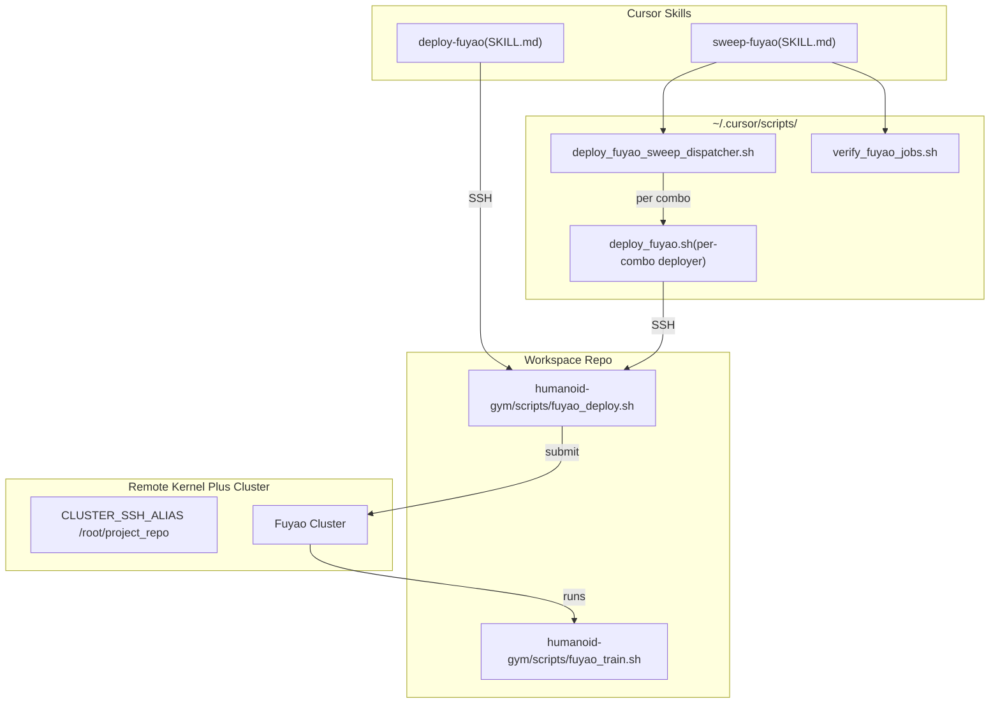
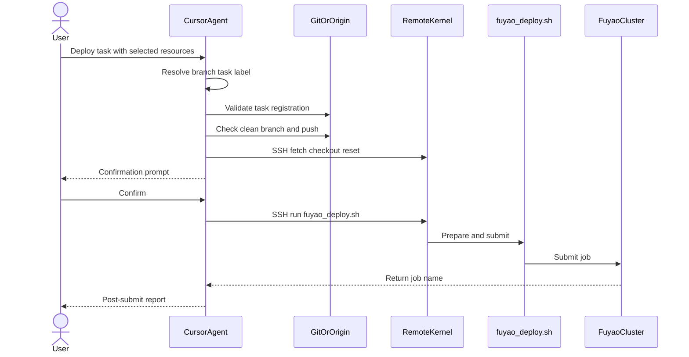
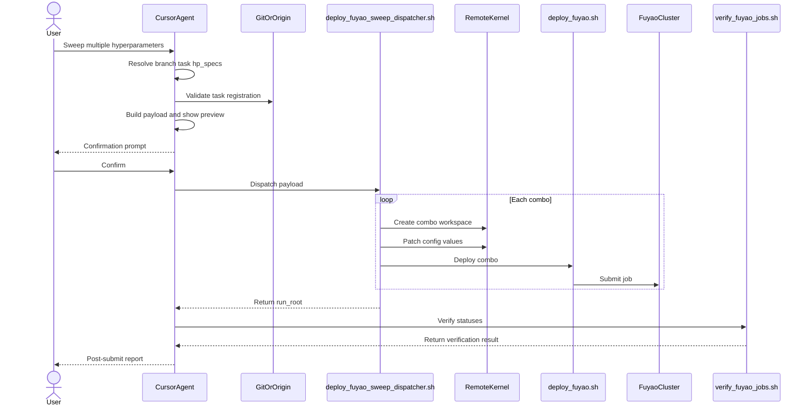

# Cursor Deploy Command Flow

## Command Relationships

## deploy-fuyao Step Sequence

## sweep-fuyao Step Sequence

## Key Differences

- deploy-fuyao runs one job per invocation.
- sweep-fuyao dispatches a parameter grid.
- sweep-fuyao patches config values per combo.
- sweep-fuyao includes mandatory post-dispatch verification.
