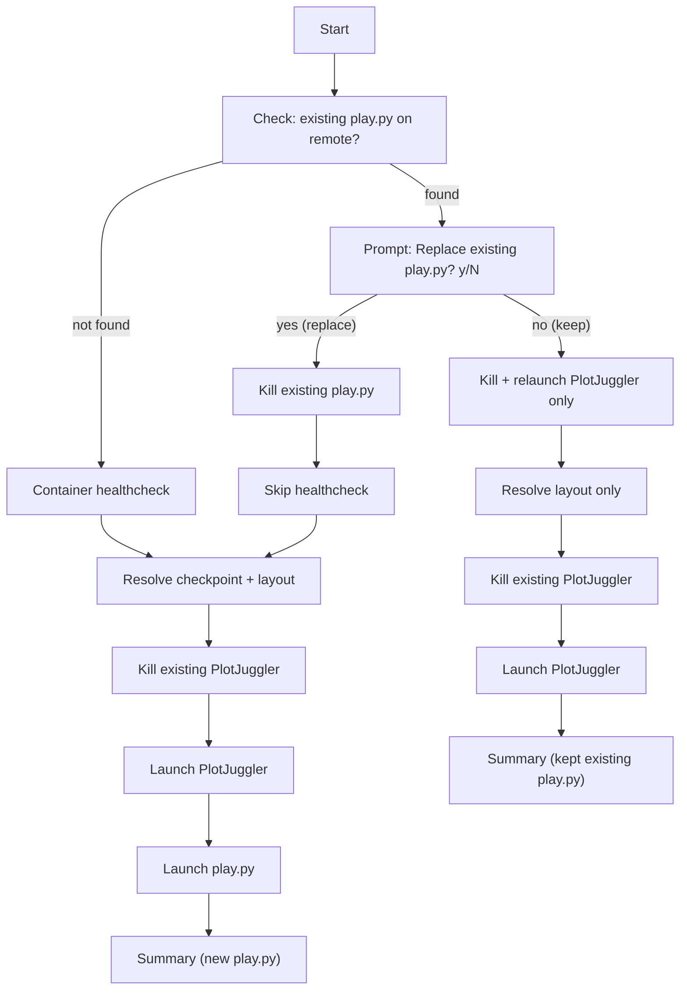

# Add Existing Process Detection to play_motion_rl.sh

## New behavior flow




## Changes to `~/.cursor/scripts/play_motion_rl.sh`

### Structural change: deferred validation

Move the `--task` and `--checkpoint` required-arg checks from immediately after parsing to **after** the process detection decision. In the "refresh" path, these args are not needed.

### New step: process detection (insert after arg parsing, before healthcheck)

1. **Detect existing play.py/play_interactive.py**: `ssh huh.desktop.us "pgrep -af 'play.*\.py.*--task'"` — captures PID and command line
2. **If found, prompt** (interactive TTY only; non-interactive defaults to fresh launch):

```
   [INFO]  Existing process detected:
   [INFO]    PID 12345: python play.py --task r01_v12_amp_...
   [INFO]  Replace with new process? [y/N]


```

1. **If yes (replace) or `--replace` flag**:
  - Kill all matching processes: `ssh huh.desktop.us "pkill -f 'play.*\.py.*--task'"`
  - Skip container healthcheck (container already running)
  - Validate `--task` and `--checkpoint` are provided
  - Continue normal flow (pull prompt, resolve checkpoint, resolve layout, PlotJuggler, play.py)
2. **If no (refresh) or `--refresh` flag**:
  - Skip healthcheck, skip pull prompt, skip checkpoint resolution
  - Validate nothing extra (only `--layout` matters, and it has a default)
  - Resolve layout (if `--layout` was specified, SCP it; otherwise use default)
  - Kill and relaunch PlotJuggler with the resolved layout
  - Skip play.py launch
  - Print summary noting existing process was kept and PlotJuggler was refreshed
3. **If not found (fresh launch)**:
  - Validate `--task` and `--checkpoint` are provided
  - Run normal flow (healthcheck, pull, checkpoint, layout, PlotJuggler, play.py)

### New flags

- `--replace`: force-replace existing process without prompt (bypass detection prompt)
- `--refresh`: keep existing process, just refresh PlotJuggler (bypass detection prompt)

## Changes to `~/.cursor/commands/play-motion-rl.md`

The command doc is the primary interface since users invoke this via agent prompt. It must instruct the agent to handle all interactive decisions before calling the script with the right flags. The agent workflow:

1. **Collect required inputs** from the user if not provided: `--task`, `--checkpoint`
2. **Pre-check for existing processes**: run `ssh huh.desktop.us "pgrep -af 'play.*\.py.*--task'"` (readonly)
3. **If existing process found**: ask the user via chat whether to replace it or just refresh PlotJuggler. Pass `--replace` or `--refresh` accordingly.
4. **If refreshing only**: `--task` and `--checkpoint` are not needed — skip collecting them
5. **Ask about pull**: ask the user, then pass `--pull` or `--no-pull`
6. **Run the script** with all flags pre-set (no interactive prompts needed since there's no TTY)
7. **Background the script** since play.py is long-running
8. **Monitor output** and report results

Document `--replace` and `--refresh` flags alongside existing flags.

## Sync

Commit, push, and sync to remote hosts.
