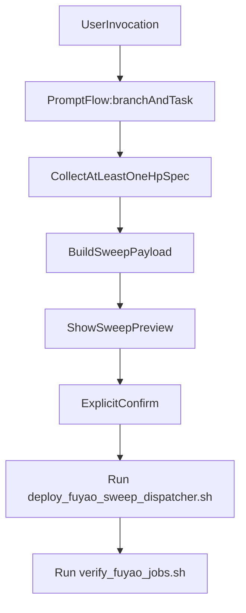

## Objective
- Remove prompt-style mismatch that currently causes plain-text-like confirmation flow instead of stepwise selectable prompts.
- Keep sweep execution semantics unchanged (`deploy_fuyao_sweep_dispatcher.sh`) but make the user-facing contract consistent with `/deploy-fuyao`.

## Actionable changes
1. Normalize required input contract
- Make `~/.cursor/commands/sweep-fuyao.md` and `~/.cursor/skills/sweep-fuyao/SKILL.md` use the same required set/order as deploy-style flow: resolve `branch`, `task`, then `hp_specs`.
- Ensure `branch`/`task` selection uses explicit single-select wording and `task` includes fallback matching behavior.
- Treat optional fields (`patch_file_rel`, `queue`, `project`, `site`, `gpus_per_node`, `gpu_type`, `priority`, `max_parallel`, `label_prefix`, etc.) as non-blocking overrides, not hard requirements.

2. Mirror deploy prompt architecture
- Introduce/align section structure in `~/.cursor/commands/sweep-fuyao.md` to match deploy's selectable contract sections:
  - `Argument Prompt Contract (Selectable Questions)`
  - `Task Validation (Mandatory + Fuzzy Match)`
  - `Defaults`
  - `Execution Workflow`
  - `Post-Submit Output`
- Add/retain explicit `Precedence order` and required prompt order for click-style progression.

3. Keep sweep-specific execution output contract in sync
- Keep command target as `bash ~/.cursor/scripts/deploy_fuyao_sweep_dispatcher.sh --payload <payload_file>`.
- Keep post-submit reporting fields (`run_root`, verification commands) aligned with deploy-like concise report style.

4. Optional hardening (if accepted)
- Reconcile any ambiguous required/optional drift between command and skill docs (especially `label`/`experiment` equivalents for sweep) so the assistant has one deterministic interpretation and does not degrade to free-text prompting.
