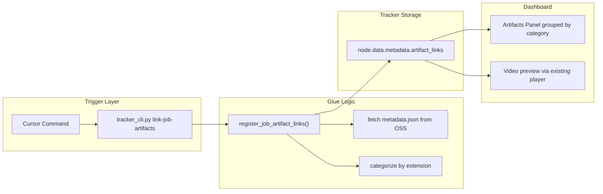

# Link-Based Fuyao Artifact Tracking

## Design Pivot: Links, Not Files

Instead of downloading artifacts to the tracker server, store only the OSS download URLs in the tracker node metadata. Benefits:

- No local storage duplication -- the tracker stays lightweight
- No download timeout issues for large checkpoints
- Any client with dashboard access can download directly from OSS
- The download URL redirects to the actual Fuyao storage, so downloads come from source

## Architecture




## OSS URL Construction (verified against Motion RL codebase)

Base URL pattern (from [rtd_artifacts_helper.py](../motion_rl/humanoid-gym/humanoid/utils/rtd_artifacts_helper.py)):

```
https://xrobot.xiaopeng.link/resource/xrobot-log/user-upload/fuyao/{user}/{job_name}/
```

Where user = last segment of job_name after splitting on "-".

Directory structure uploaded by play.py:

```
{base_url}/{ckpt_folder}/                       -- checkpoint dir name
  {model_name}.pt                                -- checkpoint
  {job_name}-{model_name}.onnx                   -- ONNX export
  {eval_case}_{timestamp}/                       -- evaluation subfolder
    {job_name}-{model_name}.mp4                  -- video
    {job_name}-{model_name}.csv                  -- trajectory CSV
    metric.json                                  -- evaluation metrics
    joint_analysis.pdf                           -- joint analysis plots
    plot_states.png                              -- state plots
metadata.json                                    -- artifact manifest
```

The metadata.json (uploaded by FuyaoMetadataWriter) contains a files list:

```json
{"files": [
  {"path": "model_9358.../model_9358...pt", "check_point": "model_9358...", "case": ""},
  {"path": "model_9358.../bifrost-...-model_9358....onnx", "check_point": "model_9358...", "case": ""},
  {"path": "model_9358.../default_.../bifrost-...-model_9358....mp4", "check_point": "model_9358...", "case": "default"}
]}
```

## Artifact Categories

- **Model**: .pt, .onnx -- deployable artifacts
- **Video**: .mp4, .avi, .webm -- evaluation recordings (also gets preview player)
- **Analysis**: .csv, .json, .pdf, .png -- evaluation data and plots

## Data Model: node.data.metadata.artifact_links

```json
{
  "artifact_links": {
    "model": [
      {"filename": "model_9358_best_k_value=48.621.pt", "url": "https://..."},
      {"filename": "bifrost-...-model_9358_best_k_value=48.621.onnx", "url": "https://..."}
    ],
    "video": [
      {"filename": "bifrost-...-model_9358_best_k_value=48.621.mp4", "url": "https://..."}
    ],
    "analysis": [
      {"filename": "metric.json", "url": "https://..."},
      {"filename": "joint_analysis.pdf", "url": "https://..."},
      {"filename": "bifrost-...-model_9358_best_k_value=48.621.csv", "url": "https://..."},
      {"filename": "plot_states.png", "url": "https://..."}
    ],
    "oss_base_url": "https://xrobot.../huh8/bifrost-2026031401372101-huh8/",
    "source": "metadata.json",
    "linked_at": "2026-03-16T..."
  }
}
```

Also set node.data.video to the .mp4 OSS URL so the existing dashboard video player renders the preview (it already handles HTTP URLs via _isHttpUrl check).

## Step 1 -- Artifact discovery via metadata.json

[tracker_auto_record.py](tracker_auto_record.py): add function to fetch metadata.json from OSS.

Two discovery strategies (fallback chain):

1. **metadata.json** -- fetch from {oss_base_url}/metadata.json, parse the files list, construct full URLs
2. **Known patterns** -- if metadata.json is unavailable, construct URLs from known naming conventions using job_name + checkpoint name (provided by user or from tracker node metadata)

The metadata.json approach is preferred because it is authoritative -- it is written by FuyaoMetadataWriter during evaluation and lists exactly what was uploaded.

Note: the OSS base URL returns a React SPA for directory listings (not static HTML), so _list_oss_files() in fuyao_job_manager.py will not work. But direct file access (e.g., fetching metadata.json by exact URL) may work. If not, fall back to known patterns.

## Step 2 -- register_job_artifact_links() in tracker_auto_record.py

```python
def register_job_artifact_links(args, store_root=None):
    job_name = args["job_name"]
    graph = sdk.get_graph(store_root=store_root)
    matches = find_by_metadata(graph, "job_name", job_name, node_type="mutation")
    node_id = matches[0]["id"]
    artifacts = _discover_artifacts(job_name)
    categorized = _categorize_artifacts(artifacts)
    sdk.edit_node(node_id, metadata={"artifact_links": categorized})
    video_url = categorized.get("video", [{}])[0].get("url", "")
    if video_url:
        sdk.edit_node(node_id, video=video_url)
    return {"ok": True, "node_id": node_id, ...}
```

Also add a new CLI subcommand "link-job-artifacts" to tracker_auto_record.py's main() dispatch.

## Step 3 -- CLI subcommand in tracker_cli.py

[tracker_cli.py](tracker_cli.py): add link-job-artifacts subcommand (thin wrapper):

```
python3 tracker_cli.py link-job-artifacts \
    --job-name bifrost-2026031401372101-huh8 \
    [--dry-run] [--checkpoint-name model_9358_best_k_value=48.621]
```

- --dry-run: show what URLs would be registered without writing
- --checkpoint-name: optional, used for fallback URL construction when metadata.json is unavailable

## Step 4 -- Dashboard Artifacts Panel with ZIP Packaging

[dashboard_server.py](dashboard_server.py): new "Artifacts" section in the inspector.

### Download UX -- single-click per artifact or category

- **Model group** (.pt, .onnx): each file is a direct download link (no ZIP -- these are single large files, direct download is simpler and faster)
- **Video group** (.mp4): direct download link + inline video preview player
- **Analysis group** (.csv, .json, .pdf, .png): "Download Analysis" button that packages all analysis artifacts into a single ZIP

### Client-side ZIP for analysis only

OSS has open CORS (access-control-allow-origin: *), so the browser fetches directly from Fuyao storage:

- Load JSZip from CDN (cdn.jsdelivr.net/npm/jszip) in the dashboard HTML
- "Download Analysis" button: fetch all analysis URLs via fetch(), add blobs to JSZip, generate ZIP, trigger download via URL.createObjectURL
- Model and video files use plain anchor tags with download attribute -- no ZIP overhead

### Panel layout in the inspector

- Header with "Artifacts" title
- **Model** section: direct download links for .pt and .onnx (each its own clickable link)
- **Video** section: direct download link + existing video preview player
- **Analysis** section: "Download Analysis ZIP" button + individual file links listed below
- Progress toast during ZIP creation: "Packaging N/M files..."

### New JS needed

- renderArtifactLinks(nodeId, artifactLinks) -- builds grouped HTML from node.data.metadata.artifact_links
- downloadAnalysisZip(files, zipName) -- fetches analysis files from OSS, creates ZIP client-side, triggers download
- Reuses existing _isHttpUrl(), _videoPreviewBlock(), _shareArtifactBtn(), toast system

## Step 5 -- Cursor command

Create [~/.cursor/commands/link-fuyao-artifacts.md](~/.cursor/commands/link-fuyao-artifacts.md):

- User provides job_name (or agent discovers from context/recent deploys)
- Agent calls tracker_cli.py link-job-artifacts
- Reports which artifacts were linked per category

## Step 6 -- Fix TYPE_PATTERNS (minor, independent)

[~/.cursor/scripts/fuyao_job_manager.py](~/.cursor/scripts/fuyao_job_manager.py):

- Add metric.json (singular) to metrics patterns: currently only matches metrics.json
- Add pdf pattern: "pdf": [r"pdf$"]
- These are independent quality-of-life fixes for the pull command

## Files Changed

- [tracker_auto_record.py](tracker_auto_record.py) -- add register_job_artifact_links(), _discover_artifacts(), _categorize_artifacts(), and CLI entry
- [tracker_cli.py](tracker_cli.py) -- add link-job-artifacts subcommand
- [dashboard_server.py](dashboard_server.py) -- add renderArtifactLinks() to inspector, add CSS for artifact groups
- [~/.cursor/commands/link-fuyao-artifacts.md](~/.cursor/commands/link-fuyao-artifacts.md) -- new Cursor command
- [~/.cursor/scripts/fuyao_job_manager.py](~/.cursor/scripts/fuyao_job_manager.py) -- fix TYPE_PATTERNS (minor)

## What Does NOT Change

- artifact_downloader.py -- not used (no downloads)
- tracker_sdk.py import_artifact/import_artifacts -- not used (no downloads)
- tracker_store.py -- data model uses existing metadata field, no schema changes
- No local asset storage needed

## Risk: OSS URL Accessibility

The OSS base URL returns a React SPA for directory listings. Direct file access (e.g., /metadata.json) also returned HTML in testing. This may be a network/VPN issue from this machine, or the OSS may require specific headers. Need to verify during implementation. If metadata.json fetch fails, the fallback is manual checkpoint name input + known naming patterns to construct URLs deterministically.