# Managed Checkpoint Upload/Download

## Goal

- Make checkpoint handling behave like a standalone app: uploaded files are copied into tracker-managed storage outside the repo, and nodes store a path string to that file.
- Keep manual external path entry supported.
- Provide browser download from the node UI.

## Current Gap

- In `[dashboard_server.py](/Users/HanHu/software/Experiment-Tracker-/dashboard_server.py)`, checkpoint drag-and-drop currently uses `file.path || file.name` and saves only a string path; no file content is uploaded or copied.

## Implementation Plan

1. **Backend upload/download endpoints in `[dashboard_server.py](/Users/HanHu/software/Experiment-Tracker-/dashboard_server.py)`**

- Add `POST /api/upload-checkpoint` to accept `multipart/form-data` and save `.pt` files under `<store_root>/checkpoints/`.
- Sanitize filename, enforce `.pt` extension, generate collision-safe managed filename, and return `{ ok, checkpoint_path, managed: true }`.
- Add `GET /api/download-checkpoint?node_id=<id>` to resolve node checkpoint path and stream as attachment for browser download.
- Add helper utilities for path resolution and safe file serving.

1. **Frontend upload flow in embedded JS in `[dashboard_server.py](/Users/HanHu/software/Experiment-Tracker-/dashboard_server.py)`**

- Add `uploadCheckpoint(file)` helper using `FormData` + `fetch`.
- Update `makeDropZone(...)` to upload dropped file first, then call `saveField(nodeId, 'checkpoint', returnedPath)`.
- Update Create Mutation modal drop zone to upload and set `#m-ckpt` with returned managed path.
- Keep manual text input unchanged so users can still store external paths.

1. **Inspector download UI in `[dashboard_server.py](/Users/HanHu/software/Experiment-Tracker-/dashboard_server.py)`**

- Add a `Download checkpoint` control for mutation nodes when `run.checkpoint` is present.
- Wire it to `/api/download-checkpoint?node_id=<id>` so browser Save As works.
- Show clear toast for missing/invalid checkpoint files.

1. **Data model compatibility in `[SCHEMA.md](/Users/HanHu/software/Experiment-Tracker-/SCHEMA.md)`**

- Keep schema unchanged (`run.checkpoint` remains a string path).
- Document two valid path modes:
  - managed tracker path (recommended)
  - manual external filesystem path (advanced/manual)

1. **Docs and verification**

- Update `[README.md](/Users/HanHu/software/Experiment-Tracker-/README.md)` with managed storage location, upload flow, and download behavior.
- Add/extend tests under `[tests/](/Users/HanHu/software/Experiment-Tracker-/tests/)` for upload validation, path persistence, and download response.

## Data Flow

```mermaid
flowchart LR
  userDrop[UserDropsPtFile] --> uploadApi["POST /api/upload-checkpoint"]
  uploadApi --> managedStore[StoreRootCheckpointsDir]
  managedStore --> checkpointPath[CheckpointPathString]
  checkpointPath --> editApi["POST /api/edit-node or /api/record-mutation"]
  editApi --> graphJson[GraphJsonRunCheckpoint]
  graphJson --> downloadApi["GET /api/download-checkpoint"]
  downloadApi --> browserSave[BrowserSaveAs]
```

