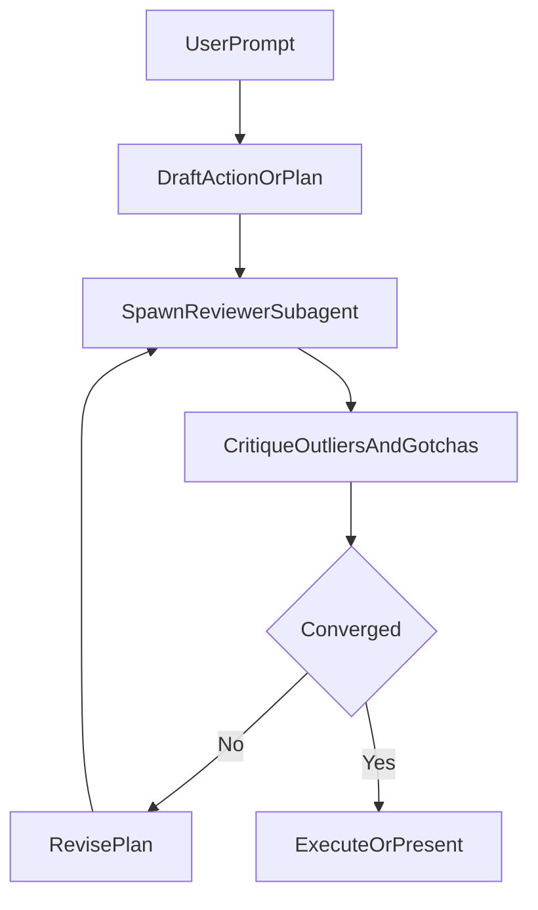

# Build Global Critique-Loop Rule

Implement one always-on global rule file at [/Users/HanHu/.cursor/rules/plan-action-critic-loop.mdc](/Users/HanHu/.cursor/rules/plan-action-critic-loop.mdc) to enforce your requested behavior for every prompt.

## Scope and Placement

- Use a **global** rule (your choice) so it applies across all projects.
- Keep existing global rules intact (including [/Users/HanHu/.cursor/rules/sync-toolbox-after-toolbox-edits.mdc](/Users/HanHu/.cursor/rules/sync-toolbox-after-toolbox-edits.mdc)); this new rule is additive.

## Rule Structure

- Add frontmatter:
  - `description`: mandate action/plan generation plus critique convergence loop
  - `alwaysApply: true`
- Include a concise title and explicit, numbered workflow instructions.

## Mandatory Workflow to Encode

1. For every user prompt, first produce either:
  - an executable action list, or
  - a structured plan.
2. Spawn a subagent reviewer dedicated to critique alignment with:
  - objective completeness,
  - constraint adherence,
  - risk/gap detection,
  - proactive outlier/gotcha discovery (including issues the user did not explicitly mention).
3. If reviewer finds objective gaps, hidden assumptions, or gotchas, revise plan/action and re-run reviewer.
4. Repeat until reviewer signals convergence (or reaches a defined escalation condition).
5. After convergence, proceed with execution (or present confirmed plan in plan-only contexts).

## Convergence and Safety Criteria

- Define explicit convergence checks in the rule:
  - objective coverage is complete,
  - constraints are satisfied,
  - critical ambiguities resolved,
  - plausible outliers/gotchas are addressed with mitigations (or explicitly accepted by the user).
- Add a bounded fallback: if repeated iterations still do not converge, ask the user a focused clarification question before continuing.

## Implementation Notes

- Keep rule concise and operational (short bullets, deterministic sequence).
- Add a compact output format section so each turn is consistent:
  - Objective snapshot
  - Current action/plan
  - Reviewer findings
  - Outliers/Gotchas and mitigations
  - Decision: iterate vs execute

## Flow Diagram

