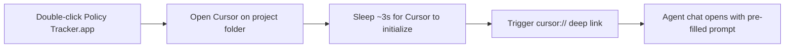

# Cursor Launcher App Bundle

## What changes

Replace [`Launch Dashboard.command`](Launch Dashboard.command) with a proper macOS `.app` bundle named **Policy Tracker.app** in the project root. The old `.command` file will be deleted.

## How it works



1. The app runs a bash script that calls `cursor /Users/HanHu/software/policy-lineage-tracker` to open the project in Cursor.
2. After a short delay (for Cursor to initialize), it invokes the Cursor deep-link URI to pre-fill the agent chat:

```
cursor://anysphere.cursor-deeplink/prompt?text=<url-encoded prompt>
```

3. The prompt text will be something like:

> "I want to update my policy lineage tracker."

This triggers the policy-lineage-tracker skill (matches trigger phrases: "policy lineage", "experiment tracker", "tracker"). The agent will then respond using the skill workflow.

## App bundle structure

```
Policy Tracker.app/
  Contents/
    Info.plist          # Bundle metadata (CFBundleExecutable, identifier, etc.)
    MacOS/
      launch            # Bash script (chmod +x) - the actual launcher
```

- **`Info.plist`** -- Minimal property list with `CFBundleExecutable` pointing to `launch`, a bundle identifier (`com.hanhu.policy-tracker`), and `LSUIElement` set to hide the Dock icon since the app just acts as a launcher.
- **`MacOS/launch`** -- Bash script that:
  1. Calls `cursor` CLI to open the project folder
  2. Sleeps 3 seconds
  3. Calls `open "cursor://anysphere.cursor-deeplink/prompt?text=..."` to open the agent chat with the skill-triggering prompt

## Notes

- No custom `.icns` icon currently exists; the app will use the default macOS app icon. A custom icon can be added later by placing an `.icns` file in `Contents/Resources/` and referencing it from `Info.plist`.
- The deep-link prompt is capped at 8,000 characters (URL-encoded), which is well within our needs.
- The user still has to confirm/send the pre-filled prompt in the chat (deep links never auto-execute).
