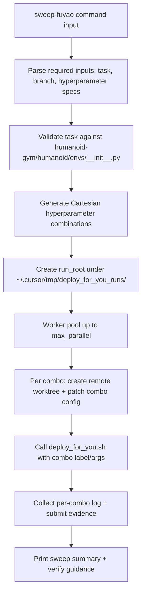

# Deploy for You Sweep Dispatcher (Replacing `/sweep-fuyao`)

This plan keeps the user-facing command as `sweep-fuyao` but changes it into a dedicated `deploy_for_you.sh`-driven dispatcher.

## Why this

- Your requested behavior is already closest to the current sweep pattern in `~/.cursor/commands/sweep-fuyao.md`, but currently there is no `deploy_for_you.sh` backend.
- A dedicated backend lets us keep `deploy-fuyao` untouched while giving you a new “deploy-for-you” execution style behind the same command.

## Planned files and changes

- Update the command contract in [`~/.cursor/commands/sweep-fuyao.md`] to explicitly route through `deploy_for_you.sh` and its dispatcher.
- Add a new backend script [`~/.cursor/scripts/deploy_for_you.sh`] that handles one concrete training run (including branch/task checks, SSH deploy command, and safe override patching from a combo spec).
- Add a new orchestrator-style dispatcher script [`~/.cursor/scripts/deploy_for_you_dispatcher.sh`] that is invoked by `/sweep-fuyao` and performs combination expansion, parallel dispatch, and run-root artifacting.
- Add optional shared helpers (`combo parsing`, `label encoding`, `safe quote helpers`) inside [`~/.cursor/scripts/deploy_for_you_dispatcher.sh`] to keep behavior consistent and testable.
- Align the dispatch payload/parse contract in [`~/.cursor/commands/sweep-fuyao.md`] and optionally [`~/.cursor/skills/hp-sweep-orchestrator/SKILL.md`] so automation remains faithful to the same user intent fields.

## Detailed implementation steps

1. Redefine `/sweep-fuyao` contract to match your requested UX.
  - Keep required items: `task`, `branch`, hyperparameter specs.
  - Add explicit format rule: one or more `key=value` entries with comma-separated values.
  - Add optional knobs: `patch_file_rel`, `queue`, `site`, `project`, `gpus_per_node`, `gpu_type`, `gpu_slice`, `max_parallel`, `label_prefix`, `dry_run`.
  - Preserve full preview behavior: show combo count, rendered combo list (or truncated preview), resource estimate, and proceed confirmation unless already explicit.
  - Set command output path to run root and verification hints (`verify_fuyao_jobs.sh`).
2. Add [`~/.cursor/scripts/deploy_for_you.sh`].
  - Implement required single-run options at minimum: `--task`, `--branch`, `--patch-file`, `--label`, `--remote-root`, `--ssh-alias`, `--site`, `--queue`, `--project`, `--experiment`, `--gpus-per-node`, `--gpu-type`, `--node`, `--dry-run`.
  - Add combo-mode patch handling: input format like `--combo-spec` (e.g., `learning_rate=1e-4;entropy_coef=0.005`) and replace matching config assignments on the selected worktree config file before deploy.
  - Keep `deploy-fuyao`-style safety guardrails where possible: branch sanity, dry-run, git-sanity checks, SSH reachability, and explicit error messages.
  - Emit concise `Deploy command submitted` + final label/branch/task line for dispatcher evidence.
3. Add [`~/.cursor/scripts/deploy_for_you_dispatcher.sh`].
  - Parse and normalize dispatcher inputs (from command-generated JSON payload or direct shell args).
  - Validate task against `humanoid-gym/humanoid/envs/__init__.py` and reject if unknown.
  - Parse hyperparameters, then generate Cartesian combinations with deterministic ordering.
  - Create run artifacts:
    - `~/.cursor/tmp/deploy_for_you_runs/<run_id>/run_manifest.json`
    - `payloads/`, `logs/`, `status/`, `artifacts/`
  - Build per-combo label from sanitized combo assignment string and index.
  - Dispatch combos in parallel with bounded concurrency.
    - Worker flow: `prepare combo worktree` -> `apply combo patch` -> `deploy_for_you.sh --skip-git-sync` -> `capture status marker/log file`.
  - Support `--dry-run` to only emit generated commands, labels, and remote paths.
  - Print final summary with:
    - run_id/run_root
    - total combos
    - per-combo status and log paths
    - one-click verification command suggestion.
4. Replace old sweep behavior wiring to the new dispatcher.
  - `/sweep-fuyao.md` should build and call
    - `bash ~/.cursor/scripts/deploy_for_you_dispatcher.sh --payload <payload_path>`
  - Keep command naming unchanged so you still invoke `/sweep-fuyao`.
5. Maintain follow-up flow.
  - Keep compatibility shim in payload parsing for legacy `hp_specs` vs `hyperparameters` field shape.
  - Add clear warning text when spec is not truly sweepable (single-value fields only, empty value lists, unsupported formats).
  - Add post-dispatch guidance for `verify_fuyao_jobs.sh --run-root <run_root> --once`.
6. Sync strategy and validation.
  - Sync toolbox updates for new/modified `~/.cursor/commands`, new script files, and any touched skill/document assets.
  - Provide explicit `run_root` artifact validation checklist in final report:
    - per-combo submit log exists
    - per-combo payload written
    - summary status file parseable

## What we should define before implementation

- Whether combo patching should support only first-level key assignments (`key=value`) initially, then expand to nested keys (`outer.inner=value`) in a follow-up.
- Whether you want hard failure on first failed combo or continue-on-error behavior (default should be continue-on-error unless you prefer fail-fast).
