## Objective
- Restore interactive, click-style prompting for `/deploy-fuyao` so required inputs are collected as selectable steps rather than free-text dumps.
- Remove contract drift that can cause prompt engine fallback.
- Keep the existing SSH/deploy behavior unchanged.

## Proposed Execution Flow

```mermaid
flowchart LR
A[User triggers /deploy-fuyao] --> B[Load command contract]
B --> C[Resolve required inputs via single-select prompts]
C --> D[Resolve optional overrides only when user requests]
D --> E[Validate task from humanoid-gym/humanoid/envs/__init__.py]
E --> F[Build payload/derived label]
F --> G[Ask explicit confirmation]
G --> H[Run deploy_fuyao dispatcher wrapper command]
H --> I[Report run output + verification commands]
```

## Plan
1. Fix required/optional contract drift in `deploy-fuyao` command source
   - File: [/.cursor/commands/deploy-fuyao.md](/Users/HanHu/.cursor/commands/deploy-fuyao.md)
   - Ensure required inputs are only:
     - `branch`
     - `task`
   - Make `label` and `experiment` explicitly optional defaults with derivation/defaults, not required.
   - Keep branch/task prompt contract as single-select; make label prompt conditional (derive + optional edit) with explicit selectable fallback.
   - Keep one clear precedence: explicit values > selectable answers > defaults.

2. Synchronize skill contract to command contract
   - File: [/Users/HanHu/.cursor/skills/deploy-fuyao/SKILL.md](/Users/HanHu/.cursor/skills/deploy-fuyao/SKILL.md)
   - Mirror the same required fields: `branch`, `task`.
   - Keep `label` as derived-from-branch default; `experiment` as optional default.
   - Update deterministic workflow step order to match command order and remove ambiguity.

3. Standardize prompt wording for click/selectable UX
   - In both files, keep option text in numbered single-select format (e.g. `1)`, `2)`, `3)`, `Enter custom ...`) to maximize UI actionability.
   - Explicitly mark optional prompts as 