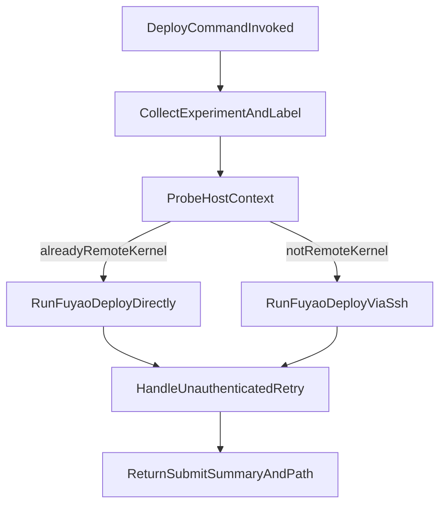

# Context-Aware Deploy FUYAO Command

## Goal

Make `/deploy-fuyao` always execute the deploy on the remote kernel, while avoiding unnecessary SSH nesting when already inside `Huh8.remote_kernel.fuyao`.

## Files To Update

- [deploy-fuyao.md](/Users/HanHu/.cursor/commands/deploy-fuyao.md)

## Planned Changes

1. **Add host-context detection step**

- In the command workflow, add a preflight probe to detect where the command is running.
- Use a command-only check (no new helper script), for example:
  - probe current fully-qualified hostname
  - compare against remote-kernel identity (`bifrost-...master-0.default.svc.cluster.local`) or alias context

1. **Add routing logic in command workflow**

- If already in remote kernel context:
  - run `fuyao deploy ...` directly.
- Otherwise (local machine, `huh.desktop.us`, `isaacgym`, or other host):
  - run deploy through SSH:
  - `ssh Huh8.remote_kernel.fuyao "fuyao deploy ..."`
- Keep your current required inputs and defaults (`experiment`, `label`, fixed flags).

1. **Preserve existing retry/auth behavior**

- Keep existing unauthenticated handling (`fuyao login` then retry), but clarify where login must occur:
  - direct mode: login in current shell
  - ssh mode: login inside remote-kernel SSH session

1. **Clarify post-submit output expectations**

- Keep current output fields (status, job, queue, project, image, label, next checks).
- Add a short line indicating execution path used (`direct` or `ssh->Huh8.remote_kernel.fuyao`).

1. **Add guardrails for robust execution**

- Keep default deploy flags unchanged unless explicitly overridden.
- Quote user inputs safely for remote shell execution.
- If host detection is ambiguous, default to SSH path for safety.

## Execution Flow

## Validation Plan

- Confirm command text includes explicit probe + branch behavior.
- Dry-run with command construction examples for:
  - local machine -> SSH branch
  - remote host/container -> SSH branch
  - remote kernel shell -> direct branch
- Verify retry instructions cover both direct and SSH execution contexts.

