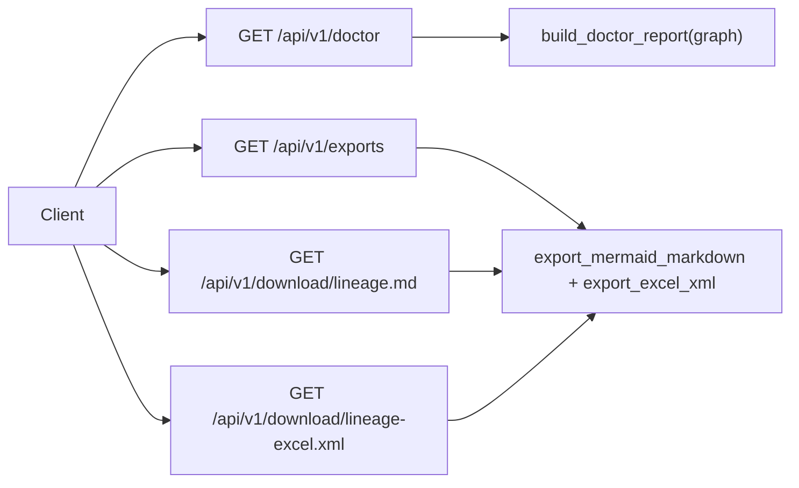

# Versioned Doctor/Export APIs

## Goal

- Build a small API set for doctor/export that is internal-only (no auth), with alias-style compatibility.
- Keep current behavior intact while adding v1 paths and a JSON metadata surface alongside download endpoints.

## Existing Baseline

- Doctor JSON exists at `[/Users/HanHu/software/Experiment-Tracker-/dashboard_server.py](/Users/HanHu/software/Experiment-Tracker-/dashboard_server.py)` route `/api/doctor`.
- Export JSON exists at `[/Users/HanHu/software/Experiment-Tracker-/dashboard_server.py](/Users/HanHu/software/Experiment-Tracker-/dashboard_server.py)` route `/api/export`.
- Download routes exist at `/download/lineage.md` and `/download/lineage-excel.xml` in `[/Users/HanHu/software/Experiment-Tracker-/dashboard_server.py](/Users/HanHu/software/Experiment-Tracker-/dashboard_server.py)`.

## API Scope (from your selections)

- Include only **doctor/export** APIs in this phase.
- Access model: **internal/local, no auth**.
- Delivery model: **both download endpoints and JSON metadata endpoints**.
- Compatibility model: **alias-style**, preserving current behaviors.

## Implementation Plan

1. **Add v1 alias routes in `[/Users/HanHu/software/Experiment-Tracker-/dashboard_server.py](/Users/HanHu/software/Experiment-Tracker-/dashboard_server.py)`**

- Add GET alias for doctor (same payload as `/api/doctor`).
- Add POST alias for export trigger (same payload as `/api/export`).
- Add v1 download aliases for Mermaid and Excel export files that stream identical bytes/headers as existing download routes.

1. **Add JSON metadata endpoint(s) for exports in `[/Users/HanHu/software/Experiment-Tracker-/dashboard_server.py](/Users/HanHu/software/Experiment-Tracker-/dashboard_server.py)`**

- Add a GET metadata endpoint that returns:
  - export file paths (mermaid/excel)
  - download URLs for both files
  - optional generated-at timestamp
- Reuse existing export helpers (`export_mermaid_markdown`, `export_excel_xml`) to avoid behavior drift.

1. **Refactor route handling for parity and maintainability in `[/Users/HanHu/software/Experiment-Tracker-/dashboard_server.py](/Users/HanHu/software/Experiment-Tracker-/dashboard_server.py)`**

- Consolidate doctor/export response construction behind small helper functions so canonical and alias routes share the exact same logic.
- Ensure alias and canonical endpoints return consistent status codes, headers, and JSON shape.

1. **Add API tests in `[/Users/HanHu/software/Experiment-Tracker-/tests/test_dashboard_server.py](/Users/HanHu/software/Experiment-Tracker-/tests/test_dashboard_server.py)`**

- Add tests asserting canonical vs alias parity for doctor JSON.
- Add tests asserting canonical vs alias parity for export JSON.
- Add tests asserting v1 download endpoints return expected content-type/content-disposition and non-empty body.
- Add tests asserting metadata endpoint contains both file paths and download URLs.

1. **Document the API set in `[/Users/HanHu/software/Experiment-Tracker-/README.md](/Users/HanHu/software/Experiment-Tracker-/README.md)`**

- Add a concise “Doctor/Export API” section listing canonical + v1 alias endpoints.
- Clarify internal/local usage and no-auth assumption.

## Data Flow

