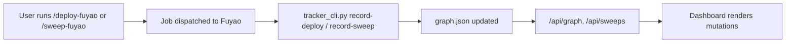

# End-to-End Integration Tests and Bug Fixes

## User requirement

"User only needs to start using the cursor commands for job deployment and will automatically see the experiments in the tracker."

The full chain:

## Critique of current implementation (Round 1)

1. **Bug in `/api/sweeps`**: Line 2041 of [dashboard_server.py](dashboard_server.py) reads `meta.get("project", "")` but labels it `"task"`. This shows "rc-wbc" where users expect to see the registered task name (e.g., "HuhR01V12SAAmpV0"). Fix: read from the mutation's `data.task_id` or use the task node's name.
2. **Single deploys invisible in Sweeps sidebar**: The Sweeps sidebar only shows mutations with `sweep_id` in metadata. Single deploys from `/deploy-fuyao` never appear there -- they only show in the main graph if the user happens to click on them. Users doing mostly single deploys won't see their experiment history in the sidebar at all.
3. **No end-to-end test**: No test validates the full chain: record via CLI -> query via dashboard API -> verify data is visible. The existing tests stop at the SDK/CLI layer.
4. `**--json-file` CLI path untested**: Skills write payloads to temp files and pass `--json-file`. Only `--json` inline is tested.

## Changes

### Round 1: Fix bugs + add E2E tests

**Fix `/api/sweeps` task field** -- Use the task node's name instead of `meta.get("project")`.

**Add "Deploys" section to sidebar** -- Show single deploys (mutations with `metadata.deploy_type == "single"`) alongside sweeps, so all Fuyao experiments are visible.

**Add E2E tests** to [tests/test_tracker.py](tests/test_tracker.py):

- `**test_e2e_deploy_visible_in_graph_api`** -- Record a deploy via CLI, then call the `/api/graph` logic and assert the mutation appears in the graph nodes.
- `**test_e2e_sweep_visible_in_sweeps_api`** -- Record a sweep via SDK, then run the `/api/sweeps` logic and assert the sweep group appears with correct combo count and status counts.
- `**test_e2e_sweeps_api_shows_correct_task_name**` -- Record a sweep, call `/api/sweeps`, assert the task field shows the registered task name (not the project).
- `**test_e2e_deploy_visible_in_deploys_section**` -- Record a deploy, call the deploys API logic, assert it appears.
- `**test_cli_record_sweep_via_json_file**` -- Write payload to a temp file, call CLI with `--json-file`, assert success.
- `**test_cli_record_deploy_via_json_file**` -- Same for deploy.

### Round 2: Self-critique and iterate

After implementing Round 1, re-run all tests, review results, critique any remaining gaps, and iterate.