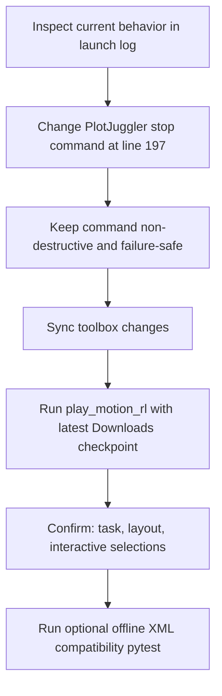

## Problem summary

The current kill step uses `pkill -f plotjuggler` (very broad). In practice it can terminate the launcher’s remote command path and abort with SSH exit 255 before launch completes.

## Targeted fix and validation

- Update only the existing PlotJuggler stop command in `[~/.cursor/scripts/play_motion_rl.sh](.../play_motion_rl.sh)` to only match the actual PlotJuggler launch signature used by this script.
- Keep all existing flags, defaults, and override semantics unchanged.
- After code change, run the existing integration rerun workflow with the latest `.pt` under `~/Downloads` and record results.




## Implementation snippet (proposed)

- Before:

```bash
ssh "${JUMP_HOST}" "pkill -f plotjuggler 2>/dev/null || true"
```

- After (example safe narrow pattern):

```bash
ssh "${JUMP_HOST}" "pkill -f 'plotjuggler --nosplash --layout' 2>/dev/null || true"
```

## Execution plan

1. Edit `[~/.cursor/scripts/play_motion_rl.sh](/Users/HanHu/.cursor/scripts/play_motion_rl.sh)`: replace the broad `pkill -f plotjuggler` call in section `# ---------- 6. Kill existing PlotJuggler ----------` with a narrower match for this launcher’s command shape.
2. Verify `[~/.cursor/scripts/play_motion_rl.sh](``.cursor/scripts/play_motion_rl.sh``)` still reads:
  - `DEFAULT_TASK=r01_v12_amp_with_4dof_arms_and_head_full_scenes`
  - `DEFAULT_LAYOUT=${REMOTE_WORKDIR}/humanoid-gym/datasets/tool/config/r01_plotjuggler_full.xml`
  - `INTERACTIVE=1`
3. Sync toolbox changes to `huh.desktop.us` using `sync_toolbox.sh apply`.
4. Re-run command: `bash ~/.cursor/scripts/play_motion_rl.sh --checkpoint <latest_downloads_pt> --skip-health --no-pull` and capture logs.
5. Confirm defaults in launch logs:
  - Task resolves to `r01_v12_amp_with_4dof_arms_and_head_full_scenes`
  - Layout resolves to `r01_plotjuggler_full.xml`
  - Interactive branch selects `play_interactive.py`
6. Optionally rerun `cd /Users/HanHu/software/motion_rl/humanoid-gym && python3 -m pytest tests/test_plotjuggler_xml_signals.py -k full` and report pass status.
