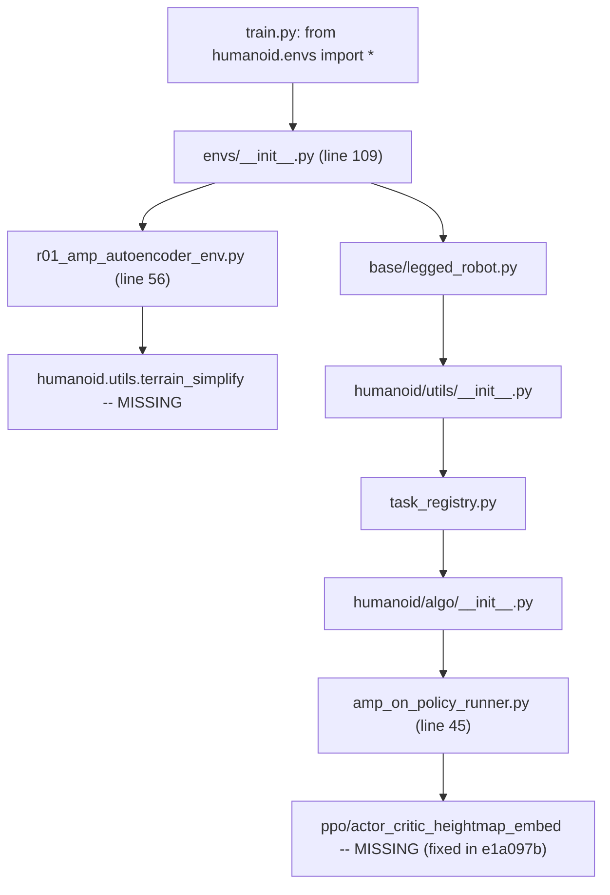

# Fix Fuyao Import Failures and Add Pre-Deploy Tests

## Root Cause

Both jobs (19396313 and 19405737) failed within seconds of startup with `ModuleNotFoundError`. The import chain is:




- **Job 19396313**: `humanoid.algo.ppo.actor_critic_heightmap_embed` missing (fixed by commit `e1a097b02`)
- **Job 19405737**: `humanoid.utils.terrain_simplify` missing (still broken)

Both modules exist only on `remotes/origin/terrain_rebase_0310_v1` and were never merged. The `__init__.py` eagerly imports every env module, so even unused envs break the entire import.

## Fix: Add Missing Module

Cherry-pick `terrain_simplify.py` (185 lines) from `remotes/origin/terrain_rebase_0310_v1` into the current branch:

```bash
git show remotes/origin/terrain_rebase_0310_v1:humanoid-gym/humanoid/utils/terrain_simplify.py \
  > humanoid-gym/humanoid/utils/terrain_simplify.py
```

Source file: exists at `remotes/origin/terrain_rebase_0310_v1:humanoid-gym/humanoid/utils/terrain_simplify.py`. Its dependencies (`scipy.ndimage`, `isaacgym.terrain_utils`, `humanoid.utils.terrain.Terrain`) are already available in the container image.

## Tests

Create `humanoid-gym/tests/` with three test files plus config. No tests exist today; no CI runs tests.

### 1. Static Import Graph Validator -- `test_import_integrity.py`

Uses Python's `ast` module to recursively trace all `humanoid.*` imports reachable from [humanoid-gym/humanoid/envs/**init**.py](humanoid-gym/humanoid/envs/__init__.py), and asserts every referenced `.py` file exists on disk. Key design:

- Parse each `.py` file's AST, extract `from humanoid.xxx import ...` and `import humanoid.xxx` statements
- Resolve each to a filesystem path under `humanoid-gym/humanoid/`
- Recurse up to depth 5 (configurable) to catch transitive chains like `__init__ -> autoencoder_env -> terrain_simplify`
- No GPU, no isaacgym, no container needed -- runs anywhere with Python 3.8+
- Would have caught **both** failures

### 2. Import Smoke Test -- `test_import_smoke.py`

- Attempts `from humanoid.envs import` * inside a subprocess
- Marked `@pytest.mark.container` (requires isaacgym environment)
- Full end-to-end validation that the import chain actually works at runtime
- Catches issues the static validator may miss (dynamic imports, C extensions, etc.)

### 3. Task Registry Validation -- `test_task_registry.py`

- After importing, verifies every task registered in `task_registry` has non-None env class, env cfg, and train cfg
- Validates a specific task name can be looked up (parameterized with common task names)
- Marked `@pytest.mark.container`

### 4. Pytest Config -- `conftest.py` + `pyproject.toml`

- Register `container` marker
- Set `humanoid-gym/` as test root
- Add to `pyproject.toml`:

```toml
  [tool.pytest.ini_options]
  markers = ["container: requires isaacgym container environment"]
  testpaths = ["tests"]


```

## Pre-Deploy Gate in `fuyao_train.sh`

Insert an import validation step in [humanoid-gym/scripts/fuyao_train.sh](humanoid-gym/scripts/fuyao_train.sh) **after** `pip install -e .` (line 35) and **before** any training logic (line 50+):

```bash
# Pre-flight: verify all env imports resolve
python -c "from humanoid.envs import *; print('Import check passed')" || {
    echo "FATAL: Python import check failed. Aborting before training."
    exit 1
}
```

This runs inside the container where isaacgym is available, fails fast with a clear message, and avoids burning GPU allocation on broken imports.

## Files Changed


| File                                              | Action                                           |
| ------------------------------------------------- | ------------------------------------------------ |
| `humanoid-gym/humanoid/utils/terrain_simplify.py` | Add (cherry-pick from terrain_rebase_0310_v1)    |
| `humanoid-gym/tests/__init__.py`                  | Create (empty)                                   |
| `humanoid-gym/tests/conftest.py`                  | Create (marker registration)                     |
| `humanoid-gym/tests/test_import_integrity.py`     | Create (static AST-based validator)              |
| `humanoid-gym/tests/test_import_smoke.py`         | Create (runtime import smoke test)               |
| `humanoid-gym/tests/test_task_registry.py`        | Create (task registry validation)                |
| `humanoid-gym/pyproject.toml`                     | Create or update (pytest config)                 |
| `humanoid-gym/scripts/fuyao_train.sh`             | Edit (add pre-flight import check after line 35) |
