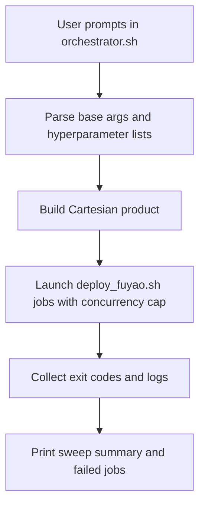

# Fuyao Sweep Orchestrator Implementation

## Scope

Implement shell-based sweep orchestration (no Cursor subagents) at the Cursor script layer, using existing deploy CLI semantics from `[deploy_fuyao.sh](/home/huh/.cursor/scripts/deploy_fuyao.sh)`.

## Files

- Create `[orchestrator.sh](/home/huh/.cursor/scripts/orchestrator.sh)`
- Reuse (no behavior change required) `[deploy_fuyao.sh](/home/huh/.cursor/scripts/deploy_fuyao.sh)`

## Implementation Plan

1. Build an interactive input stage in `orchestrator.sh` that prompts for:

- required deploy inputs (`--task`, optional branch/label/experiment/queue/resources)
- sweep hyperparameters as `key=val1,val2,val3` lines
- optional fixed args shared by all jobs (e.g., `--rl-device`, resume/checkpoint options)

1. Generate the Cartesian product of all hyperparameter value lists.
2. For each combination, compose a unique job label suffix and a deploy command invoking `deploy_fuyao.sh` with the selected arguments.
3. Execute deployments in parallel shell workers (one process per combo), with a user-configurable max concurrency limit.
4. Add robust operational behavior:

- dry-run preview mode
- per-job log files + summary table (submitted/succeeded/failed)
- fail-fast toggle vs continue-on-error mode
- input validation for malformed hyperparameter specs

1. Print a final recap including total combos, command examples, and failed job references.

## Execution Flow

## Acceptance Criteria

- Running `bash /home/huh/.cursor/scripts/orchestrator.sh` interactively produces N combinations from provided hyperparameters.
- Script submits N deploy calls through `deploy_fuyao.sh`.
- Parallelism is bounded by a configurable concurrency value.
- Dry-run mode prints exact commands without submission.
- Final output clearly reports success/failure per combination.
