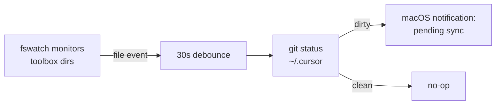

# Harden Rule Enforcement

## 1. Sync-toolbox: external file-watcher hard gate

**Goal**: Detect unsynchronized toolbox changes independently of the LLM and fire a macOS desktop notification.

- Install `fswatch` via Homebrew (`brew install fswatch`).
- Create a watcher script at `~/.cursor/scripts/toolbox_sync_watcher.sh` that:
  - Monitors `~/.cursor/{skills,commands,rules,scripts,agents}/` for writes.
  - On change, waits a debounce window (e.g., 30s) for the agent to run sync.
  - After the window, checks `git status --short` in `~/.cursor/` for uncommitted toolbox files.
  - If dirty, fires `osascript -e 'display notification ...'` with "Toolbox changes pending sync".
  - If clean (committed + pushed), stays silent.
- Create a launchd plist at `~/Library/LaunchAgents/com.cursor.toolbox-sync-watcher.plist` that:
  - Runs the watcher script on login via `RunAtLoad`.
  - Keeps it alive via `KeepAlive`.
  - Logs to `~/.cursor/logs/toolbox_sync_watcher.log`.
- Load the agent with `launchctl load`.

## 2. Critic-loop: compress rule + extract reviewer agent

**Goal**: Shrink [plan-action-critic-loop.mdc](~/.cursor/rules/plan-action-critic-loop.mdc) from 72 lines to ~20 lines; move detailed checklist into a new agent definition.

### 2a. New agent: `~/.cursor/agents/critique-reviewer.md`

Move lines 27-52 (the full reviewer checklist: contract validity, proposed-change correctness, convergence criteria) from the current rule into this agent file. This content is only needed when the reviewer subagent is spawned, not on every turn.

Key sections to relocate:

- Task classification definitions (contractable vs non-contractable)
- Contract structure (pre/post/invariant/non-conditions)
- Reviewer two-phase check (contract validity + proposed-change correctness)
- Convergence criteria list
- Per-iteration output format template

### 2b. Compressed rule: `~/.cursor/rules/plan-action-critic-loop.mdc`

Rewrite to ~20 lines focusing on the single observable requirement:

- Classify task as `Contractable` or `Non-contractable` (1-line definitions each).
- Write a 1-sentence objective snapshot.
- **First tool call must be** a `Task` invocation spawning the `critique-reviewer` agent with the objective snapshot and proposed plan.
- If reviewer returns unresolved issues, revise and re-spawn (max 3 cycles).
- Do not execute before reviewer convergence.

This makes compliance observable: every agent turn for a contractable task should have a `Task` tool call as its first action.

## Files touched

- **New**: `~/.cursor/scripts/toolbox_sync_watcher.sh`
- **New**: `~/Library/LaunchAgents/com.cursor.toolbox-sync-watcher.plist`
- **New**: `~/.cursor/agents/critique-reviewer.md`
- **Modified**: `~/.cursor/rules/plan-action-critic-loop.mdc` (72 lines -> ~20 lines)
- **Install**: `brew install fswatch`
