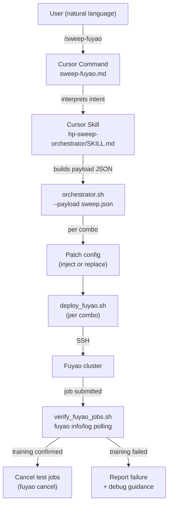

# Hyperparameter Sweep Workflow Automation

## TOP PRIORITY (recall at the start of every iteration)

**Reliability is the #1 priority.** The orchestrator must work correctly on the first attempt so the user never has to go back and forth debugging. Every component must be defensively coded with:

- Explicit error messages that tell the user exactly what went wrong and how to fix it
- Pre-flight checks before any remote operation (SSH reachable, paths exist, git state clean, task registered)
- Idempotent operations (safe to re-run without side effects)
- Graceful degradation (one combo failing doesn't kill the whole sweep)
- End-to-end verification that training actually started, not just that the deploy command returned 0

At the start of each implement-critique iteration, re-read this section and ask: "Does this change make the workflow MORE reliable, or does it introduce fragility?"

## Architecture

## Key Files

- Orchestrator: `[~/.cursor/scripts/orchestrator.sh](/Users/HanHu/.cursor/scripts/orchestrator.sh)` -- existing, needs patching enhancement
- Deploy script: `[~/.cursor/scripts/deploy_fuyao.sh](/Users/HanHu/.cursor/scripts/deploy_fuyao.sh)` -- existing, no changes needed
- SA config (default patch target): `[humanoid-gym/humanoid/envs/r01_amp/r01_v12_sa_amp_config_with_arms_and_head_full_scenes.py](/Users/HanHu/software/motion_rl/humanoid-gym/humanoid/envs/r01_amp/r01_v12_sa_amp_config_with_arms_and_head_full_scenes.py)`

## 1. Enhance orchestrator patcher -- auto-inject missing overrides

Current `prepare_remote_combo_repo()` in `orchestrator.sh` uses an inline Python script that does regex `subn` and fails if `n == 0`. Enhance it to:

- First attempt regex replace (existing behavior)
- If no match (`n == 0`), locate the correct inner class (e.g. `class algorithm`) in the file and inject `key = value` as a new line
- Support a `hp_class_map` in the payload that maps parameter names to their target inner class (e.g. `{"learning_rate": "algorithm", "amp_task_reward_lerp": "runner", "mirror_loss_coeff": "algorithm.symmetry_cfg"}`)
- Default class map for common params: `learning_rate -> algorithm`, `entropy_coef -> algorithm`, `gamma -> algorithm`, `clip_param -> algorithm`, `amp_task_reward_lerp -> runner`, `mirror_loss_coeff -> algorithm.symmetry_cfg`, `use_mirror_loss -> algorithm.symmetry_cfg`, `max_iterations -> runner`

## 2. Create verification script `~/.cursor/scripts/verify_fuyao_jobs.sh`

New script that:

- Accepts a sweep run root directory (from orchestrator output)
- Reads the run manifest and per-combo payloads to extract job labels
- SSHs to `Huh8.remote_kernel.fuyao` and runs `fuyao info` / `fuyao log` for each job
- Polls with configurable interval (default 30s) and max attempts (default 20)
- Looks for training-started markers in logs: `"Starting training"`, `"num_learning_iterations"`, `"Mean reward"`, `train.py` process running
- Outputs per-job status: `pending -> scheduled -> running -> training_confirmed` or `failed`
- Writes results to `{run_root}/verification/` directory

## 3. Add cancel capability to orchestrator

Add `--cancel-sweep <run_root>` mode to `orchestrator.sh` that:

- Reads the run manifest
- Extracts job names/labels
- Runs `fuyao cancel <job>` for each via SSH
- Reports cancellation results

## 4. Create Cursor command `~/.cursor/commands/sweep-fuyao.md`

New `/sweep-fuyao` command that:

- Accepts natural language sweep descriptions
- Documents the payload schema with examples
- Instructs the agent to build the JSON payload, run orchestrator, verify, and report
- References the skill for detailed NLP parsing guidance

## 5. Create Cursor skill `~/.cursor/skills/hp-sweep-orchestrator/SKILL.md`

Skill that teaches the agent to:

- Parse natural language like "sweep learning_rate over 1e-4, 2e-4, 3e-4 and entropy_coef over 0.01, 0.005"
- Identify task, branch, and hyperparameters from context
- Build the sweep payload JSON
- Run `orchestrator.sh --payload <file>`
- Run `verify_fuyao_jobs.sh <run_root>` to confirm training started
- Cancel test jobs with `orchestrator.sh --cancel-sweep <run_root>` after verification
- Report results with a clean summary table

Key NLP patterns to handle:

- "sweep X over [values]" / "try X = a, b, c"
- "on task Y" / "for task Y"
- "on branch Z" / "using branch Z"  
- "with N GPUs" / "priority high"
- "dry run" / "just show me what would happen"

## 6. Implement-Critique-Test cycle

After building all components:

1. **Dry run test**: Run orchestrator with `--dry-run` to verify payload generation, combo expansion, and command composition without submitting
2. **Single-combo live test**: Submit 1 job (simplest sweep: 1 param, 1 value) to verify end-to-end flow
3. **Verify training started**: Run verification script, confirm training logs appear
4. **Cancel test job**: Cancel the test job to avoid wasting resources
5. **Critique**: Review logs for any issues, fix, iterate
6. **Multi-combo test**: If single-combo passes, test with 2-3 combos
7. **Verify + cancel multi-combo**: Confirm all jobs train, then cancel

## 7. User dry-run walkthrough

After convergence, provide an interactive example showing:

- How to invoke `/sweep-fuyao` with natural language
- What the generated payload looks like
- What the orchestrator output looks like
- How to check job status
- How to cancel jobs

