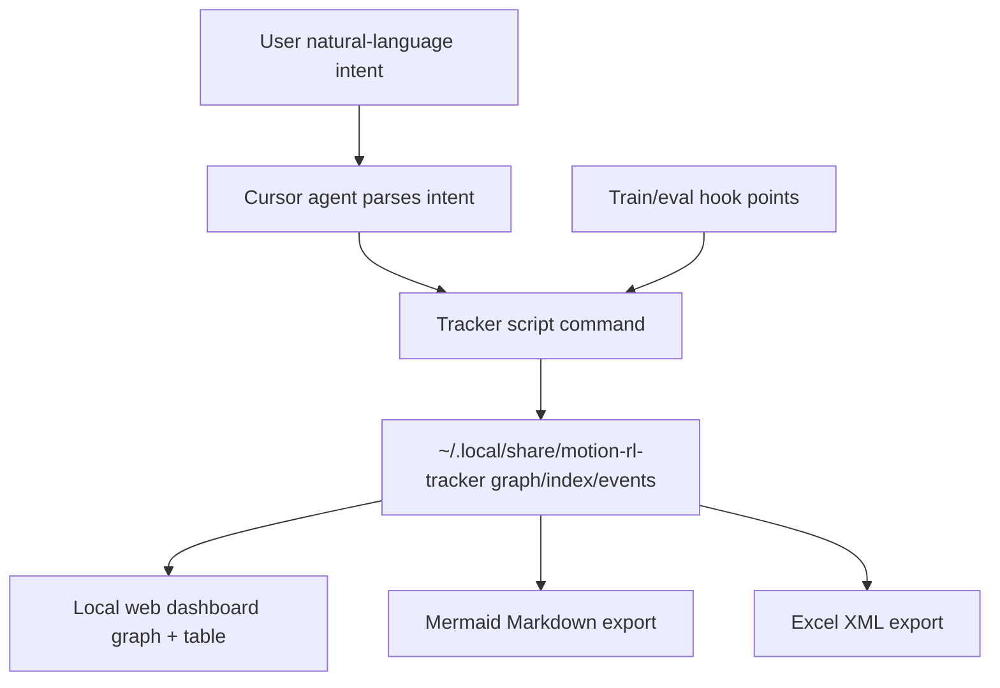

# Local Policy Lineage Tracker Plan

## Goal

Create a local-only experiment tracking system for `motion_rl` where:

- Task is the top-level parent context.
- Each mutation is a first-class node.
- Each training run is a first-class node linked from mutation nodes.
- Lineage supports multi-parent DAG edges.
- Outputs include Mermaid graph in Markdown and Excel XML table export.
- A Cursor-facing agent workflow parses natural-language commands and calls scripts to record updates.

## Core Design

### Data Location (local-only)

- Store tracker data under `~/.local/share/motion-rl-tracker`.
- Keep repo untouched for shared collaborators; scripts read/write outside git-tracked project state.

### Canonical Graph Model

- `TaskNode`: logical experiment family (e.g., humanoid velocity tracking variant).
- `MutationNode`: hyperparameter/config delta event; supports one or many parent mutation/run references.
- `RunNode`: concrete train/eval execution and resulting artifacts/metrics.
- Edges:
  - `TaskNode -> MutationNode`
  - `MutationNode -> RunNode`
  - `RunNode/MutationNode -> MutationNode` (multi-parent DAG for merged ideas/policies)

### Local Storage Schema

- `~/.local/share/motion-rl-tracker/graph.json`
  - nodes, edges, timestamps, tags, notes, status.
- `~/.local/share/motion-rl-tracker/index.json`
  - fast lookup indexes by task/run/checkpoint names.
- `~/.local/share/motion-rl-tracker/exports/`
  - generated `lineage.md` (Mermaid block) and `lineage-excel.xml`.
- Optional append-only audit log:
  - `~/.local/share/motion-rl-tracker/events.jsonl`.

## Repo Integration Points

- Hook run bootstrap metadata in [task_registry.py](/home/huh/software/motion_rl/humanoid-gym/humanoid/utils/task_registry.py).
- Hook checkpoint/iteration updates in:
  - [amp_on_policy_runner.py](/home/huh/software/motion_rl/humanoid-gym/humanoid/algo/amp_ppo/amp_on_policy_runner.py)
  - [on_policy_runner.py](/home/huh/software/motion_rl/humanoid-gym/humanoid/algo/ppo/on_policy_runner.py)
- Hook evaluation artifact linkage in:
  - [play.py](/home/huh/software/motion_rl/humanoid-gym/humanoid/scripts/play.py)
  - [evaluate.py](/home/huh/software/motion_rl/humanoid-gym/humanoid/scripts/evaluate.py)
- Reuse compatibility with existing `metadata.json` (`check_point` key) and `metric.json` list format.

## Dashboard + Export Surface

- Add a local web app (read/write local tracker store) with:
  - DAG view (task/mutation/run node types).
  - Filterable/sortable table (task, run, mutation deltas, metrics, status).
  - Export buttons:
    - Mermaid Markdown (`lineage.md`) for shared docs.
    - Excel 2003 XML table (`lineage-excel.xml`) for spreadsheet import.
- Keep dashboard decoupled from heavy training process; updates happen by script/API writes.

## Cursor Agent Workflow

- Provide a script command interface the Cursor agent can call (LLM parses user NL; script receives structured args).
- Example operations:
  - create task
  - record mutation (with parent references + hyperparameter delta)
  - attach run result/checkpoint/metrics
  - mark candidate/promoted/archived
  - export mermaid/excel
- Include strict validation of IDs, parent existence, and cycle prevention in DAG writes.

## High-Level Flow

## Implementation Sequence

1. Define schema + validators + DAG integrity rules.
2. Implement tracker core script (CRUD + lineage + exports).
3. Implement local web dashboard (graph/table + download endpoints).
4. Add minimal hooks in train/eval code paths to auto-register run events.
5. Add Cursor-agent-facing command contract and usage docs.
6. Dry-run with a few existing experiments and verify exported Mermaid/Excel imports.

## Acceptance Criteria

- Local tracking files are written only under `~/.local/share/motion-rl-tracker`.
- Multi-parent mutation lineage is represented and cycle-safe.
- Mermaid export pastes into docs and renders correctly.
- Excel XML opens cleanly in Excel/LibreOffice with correct columns.
- Dashboard shows synchronized graph + table for at least one task with multiple mutated children and run nodes.
