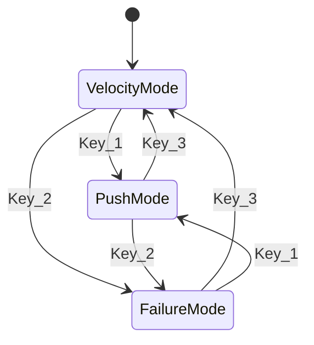

# Modal Disturbance Controls for play_interactive.py

## Architecture



Three modes share the WASD/QE keys. P applies all configured disturbances. R clears the active mode's config. Tab resets the full environment.

## File to modify

- [humanoid-gym/humanoid/scripts/play_interactive.py](humanoid-gym/humanoid/scripts/play_interactive.py) -- full rewrite of control logic

## Key Map

| Key | Velocity Mode (3) | Push Mode (1) | Failure Mode (2) | Global |
|-----|-------------------|---------------|------------------|--------|
| W/S | lin_vel_x +/- | push_x +/- | -- | |
| A/D | lin_vel_y +/- | push_y +/- | -- | |
| Q/E | ang_vel_yaw +/- | -- | cycle joint cursor prev/next | |
| 0 | zero commands | -- | -- | |
| R | zero commands | zero push vector | deselect all failed joints | |
| P | | | | apply all disturbances |
| Tab | | | | full env reset (pose + clear all) |
| 1 | switch to push | (already in) | switch to push | |
| 2 | switch to failure | switch to failure | (already in) | |
| 3 | (already in) | switch to velocity | switch to velocity | |
| ESC | | | | quit |
| V | | | | toggle viewer sync |

## State to Maintain

```python
class InteractiveState:
    mode: int  # 1=push, 2=failure, 3=velocity (default=3)

    # Push config (persists across P presses)
    push_vec_xy: torch.Tensor  # shape (2,), world-frame push velocity

    # Failure config (persists until R)
    failed_joints: set[int]    # set of DOF indices with PD-snap failure
    joint_cursor: int          # current joint index for cycling (0..num_dof-1)

    # Velocity commands (persists until R or 0)
    user_commands: torch.Tensor  # shape (num_envs, 4)
```

## Push (P applies)

When P is pressed (in any mode), apply ALL configured disturbances:

1. **Push**: if `push_vec_xy` is non-zero, apply additive velocity teleport:
   - `env.root_states[:, 7:9] += push_vec_xy`
   - `set_actor_root_state_tensor_indexed(...)`
   - Push vector **persists** (press P again to repeat)

2. **Joint failure**: for each DOF index in `failed_joints`, override actions before `env.step()`:
   - `actions[:, idx] = 0.0` -- PD controller drives joint to `default_dof_pos`
   - This override is applied **every step** while the joint is in the failed set, not just on P press
   - This works for any env (no dependency on stability_priority)

3. **Velocity commands**: `user_commands` stay as-is (no zeroing on failure, unlike training -- user controls velocity independently)

## Joint Failure Visualization

Use `gym.set_rigid_body_color()` to color failed joints red. The DOF-to-body mapping is built at init:

```python
dof_body_indices = []
for i, dof_name in enumerate(env.dof_names):
    # Each DOF's child link: typically body index = dof_index + 1 (root has no DOF)
    # Fallback: search body_names for matching link name
    dof_body_indices.append(i + 1)
```

Color updates happen every frame in the render:
- **Failed joints**: red `(1, 0, 0)`
- **Cursor joint** (in failure mode): yellow `(1, 1, 0)` if not failed, orange `(1, 0.5, 0)` if failed
- **Healthy joints**: reset to default gray `(0.7, 0.7, 0.7)`

## HUD

The OpenCV HUD window changes content based on active mode:

**Velocity mode (3):**
```
[VELOCITY MODE]
lin_vel_x:   +0.30
lin_vel_y:   +0.00
ang_vel_yaw: +0.10
```

**Push mode (1):**
```
[PUSH MODE]
push_x: +0.50
push_y: -0.20
|push|:  0.54
```

**Failure mode (2):**
```
[FAILURE MODE]
cursor: leg_l_3 (idx 2)
failed: leg_l_1, leg_l_2, arm_r_1
```

All modes show a persistent status bar at the bottom:
```
failed joints: 3  |  push: (0.50, -0.20)
```

## R (Mode-Specific Clear)

R clears only the active mode's configuration:

- **Velocity mode (3):** `user_commands[:] = 0` (zero all velocity commands)
- **Push mode (1):** `push_vec_xy[:] = 0` (zero the push vector)
- **Failure mode (2):** `failed_joints.clear()`, reset all body colors to default, clear `failure_triggered` if present

## Tab (Full Environment Reset)

Tab performs a full reset -- robot pose, physics state, and all interactive config:

- `env.reset_idx(all_envs)`
- `user_commands[:] = 0`
- `push_vec_xy[:] = 0`
- `failed_joints.clear()`
- Reset all body colors to default
- If env has `failure_triggered`: set to False

## Increment Step Sizes

- Push: `abs(cfg.domain_rand.max_push_vel_xy) / 10` per press (same 10% rule as velocity)
- Velocity: same as current (`abs(range_max) / 10`)
- Fallback for zero ranges: `max(value, 0.1)`

## Startup

Default mode is **3 (velocity)**. Banner prints all three mode descriptions and key bindings.
