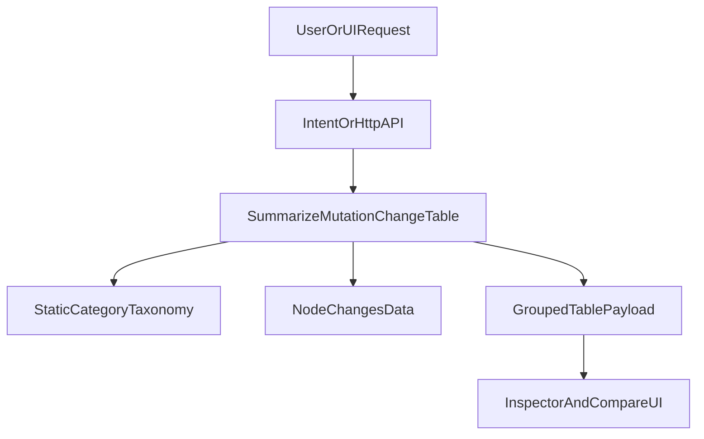

# Node Mutation Change Tables

- **Why**: The issue is that node changes are currently raw `changes[]` lists without a concise, category-grouped mutation table (including before/after values) and without a dedicated API surface.
- **What**: Add a deterministic change-table builder, expose it through intent/CLI + dashboard API, render it in dashboard UI, and cover with tests (including the existing failing test baseline fix).
- **Where**: `[/Users/HanHu/software/Experiment-Tracker-/tracker_store.py](/Users/HanHu/software/Experiment-Tracker-/tracker_store.py)`, `[/Users/HanHu/software/Experiment-Tracker-/tracker_cli.py](/Users/HanHu/software/Experiment-Tracker-/tracker_cli.py)`, `[/Users/HanHu/software/Experiment-Tracker-/dashboard_server.py](/Users/HanHu/software/Experiment-Tracker-/dashboard_server.py)`, `[/Users/HanHu/software/Experiment-Tracker-/tests/test_tracker.py](/Users/HanHu/software/Experiment-Tracker-/tests/test_tracker.py)`, `[/Users/HanHu/software/Experiment-Tracker-/tests/test_dashboard_server.py](/Users/HanHu/software/Experiment-Tracker-/tests/test_dashboard_server.py)`, `[/Users/HanHu/software/Experiment-Tracker-/SCHEMA.md](/Users/HanHu/software/Experiment-Tracker-/SCHEMA.md)`, `[/Users/HanHu/software/Experiment-Tracker-/README.md](/Users/HanHu/software/Experiment-Tracker-/README.md)`, `[/Users/HanHu/software/Experiment-Tracker-/cursor_agent_contract.md](/Users/HanHu/software/Experiment-Tracker-/cursor_agent_contract.md)`
- **Outcome**: For mutation nodes, users can get a concise categorized table (`category`, `path`, `before`, `after`, `change_type`, `reason`) via API and see it in the dashboard; task nodes return a clear mutation-only error.

## Implementation Plan

### 1) Backend table builder and taxonomy

- In `tracker_store.py`, add a deterministic classifier for change paths with Motion_RL-informed static prefixes (no runtime dependency on `motion_rl`):
  - `optimizer_hyperparameters`: `train.*`, `algorithm.*`, `policy.*`
  - `environment_configuration`: `env.*`, `terrain.*`, `commands.*`, `init_state.*`
  - `reward_configuration`: `rewards.*`, `rewards.scales.*`
  - `domain_randomization`: `domain_rand.*`
  - `curriculum`: `curriculum.*`, `terrain.curriculum`, `commands.curriculum`
  - `observation_noise_normalization`: `noise.*`, `normalization.*`, `obs.*`
  - `simulation_physics`: `sim.*`, `physx.*`
  - `urdf_assets`: `asset.*`, `urdf.*`, `usd.*`, `mesh.*`
  - `control_actuation`: `control.*`
  - `runtime_runner`: `runner.*`, `seed`
  - fallback: `other`
- Precedence rule: explicit `change.category` from stored data overrides inferred category.
- Add `summarize_mutation_change_table(graph, node_id)` that:
  - validates `node_id` exists and is `mutation` (task => error)
  - returns stable payload with sorted groups/rows and concise counts.

### 2) API/intent surfaces (design-intent aligned)

- In `tracker_cli.py`:
  - add read action `summarize_node_changes`
  - extend `_normalize_intent`, `_preview_intent`, `cmd_apply_intent`
  - add CLI command `summarize-node-changes --node-id <id>`.
- In `dashboard_server.py`:
  - add `GET /api/node-change-table?node_id=...`
  - response shape: `{"ok": true, "table": {...}}`
  - errors use existing pattern `{"ok": false, "error": "..."}` with consistent status codes.
- Payload contract (stable):
  - top-level: `node_id`, `node_type`, `summary`, `total_changes`, `category_count`, `groups[]`
  - each group: `category`, `count`, `rows[]`
  - each row: `path`, `before`, `after`, `change_type`, `reason`, `category`.

### 3) Dashboard UI table rendering

- In `dashboard_server.py` embedded JS:
  - fetch `/api/node-change-table` for selected mutation node
  - render grouped category sections in Inspector as a compact table
  - keep existing compare diff; add category table support in compare flow by reusing node table payloads (fetch per selected node and render side-by-side when both nodes are selected).
- For non-mutation nodes, show backend error message cleanly in UI (no crash).

### 4) Test plan and baseline fix

- In `tests/test_tracker.py`:
  - fix the pre-existing suite blocker (`cmd_attach_run` import/test mismatch) to align with the current mutation-embedded run model so the suite can pass.
  - add tests for:
    - category inference by path prefix
    - explicit `change.category` override
    - delete change handling (`change_type=delete`, `after=None`)
    - mutation-only enforcement for task node
    - intent dry-run/execute path for `summarize_node_changes`
    - CLI command output shape.
- In `tests/test_dashboard_server.py`:
  - add tests for `/api/node-change-table` success and error cases.

### 5) Docs and contract updates

- Update `SCHEMA.md` with the new read surface and response contract.
- Update `README.md` with CLI/API usage examples for summarized mutation tables.
- Update `cursor_agent_contract.md` with intent template and utterance mapping for `summarize_node_changes`.

### 6) Verification

- Run `python3 -m unittest discover -s tests`.
- Acceptance criteria:
  - full suite passes
  - new intent/action works via dry-run and execute
  - `/api/node-change-table` returns grouped rows for mutation nodes and error for task nodes
  - dashboard inspector/compare renders concise categorized tables without regressions.

