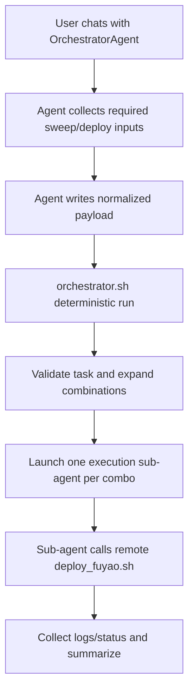

# Orchestrator Agent + Shell Backend Plan

## Goal

Implement a two-layer orchestration model where:

- **Orchestrator Agent** is the primary interactive chat frontend that gathers sweep requirements from you.
- **`orchestrator.sh`** is the deterministic backend engine that validates inputs, expands combinations, and dispatches one submission sub-agent per combo.

## Confirmed Architecture

- Agent-first interaction: user talks to the Orchestrator Agent.
- Shell-backed reliability: the agent invokes `orchestrator.sh` with structured arguments to ensure predictable workflow.
- Per-combo execution remains delegated to submission sub-agents, each calling remote `/root/.cursor/scripts/deploy_fuyao.sh`.

## Files To Update

- `/home/huh/.cursor/scripts/orchestrator.sh`
- `/home/huh/.cursor/scripts/deploy_fuyao.sh` (only if argument parity/validation updates are needed)
- Add orchestrator-agent prompt/spec artifact under `/home/huh/.cursor/scripts/` for reproducible frontend behavior

## Implementation Steps

1. **Define Orchestrator Agent frontend contract**
   - Create a dedicated agent prompt/spec that interactively asks for required sweep + deploy parameters.
   - Ensure the agent outputs a normalized argument payload (JSON or key-value manifest) consumable by `orchestrator.sh`.
2. **Backend argument interface for orchestrator.sh**
   - Add a non-interactive mode to `orchestrator.sh` (input file or CLI flags) so agent-provided payload can run deterministically.
   - Keep existing validations: task registration check in `envs/__init__.py`, hp spec validation, cartesian expansion.
3. **Sub-agent dispatch from backend**
   - `orchestrator.sh` dispatches one execution sub-agent per combo using bounded parallelism.
   - Each execution sub-agent receives only combo-specific payload and invokes remote `/root/.cursor/scripts/deploy_fuyao.sh`.
4. **Reliability and observability**
   - Persist run manifest, per-combo payloads, status files, and logs.
   - Add final summary with success/failure counts and retry commands.
5. **Frontend-backend handshake documentation**
   - Document required fields, defaults inherited from `deploy_fuyao.sh`, and example agent output payload.

## Data Flow

## Acceptance Criteria

- Orchestrator Agent is the primary user interaction layer.
- `orchestrator.sh` can run from agent-provided payload without manual prompting.
- One execution sub-agent is spawned per combo with bounded parallelism.
- Actual submissions are done by execution sub-agents via remote `/root/.cursor/scripts/deploy_fuyao.sh`.
- End-of-run report includes per-combo result and retry guidance.
