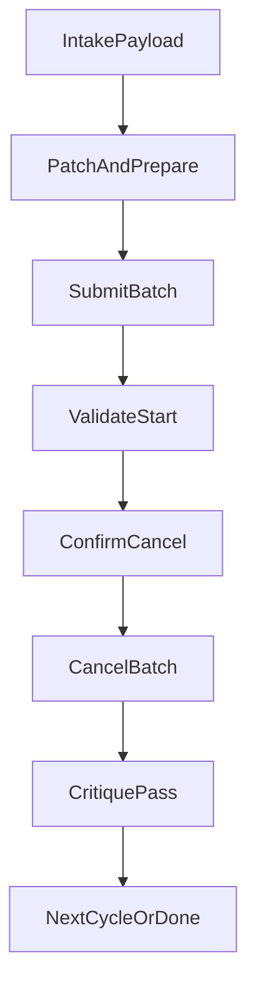

# Parallel Fuyao Sweep Workflow Plan

## Scope and Guardrails

- Keep all edits outside Motion RL repo; only update toolbox assets under `~/.cursor`.
- Execute all deploy/check/cancel actions on remote kernel alias `Huh8.remote_kernel.fuyao`.
- Preserve task validation against `r01_v12_sa_amp_with_4dof_arms_and_head_full_scenes` registration in `humanoid-gym/humanoid/envs/__init__.py`.
- Enforce explicit confirmation before any real Fuyao push/cancel actions.
- Enforce parallel deployment per cycle (not sequential), with at most 2 live jobs per cycle.

## Files to Update

- `[/home/huh/.cursor/scripts/orchestrator.sh](/home/huh/.cursor/scripts/orchestrator.sh)`
- `[/home/huh/.cursor/scripts/deploy_fuyao.sh](/home/huh/.cursor/scripts/deploy_fuyao.sh)`
- `[/home/huh/.cursor/scripts/training_deployment_orchestrator_agent.md](/home/huh/.cursor/scripts/training_deployment_orchestrator_agent.md)`
- `[/home/huh/.cursor/commands/deploy-fuyao.md](/home/huh/.cursor/commands/deploy-fuyao.md)`
- New tutorial: `[/home/huh/.cursor/scripts/fuyao_sweep_tutorial.md](/home/huh/.cursor/scripts/fuyao_sweep_tutorial.md)`

## Implementation Plan

1. Upgrade deploy receipt and control surface in `deploy_fuyao.sh`.

- Add machine-parseable job receipt output (job name/id/label/site/queue) so orchestrator can track real jobs.
- Add helper mode for post-submit status checks (`fuyao info`) and log checks (`fuyao log`) through the same SSH path.
- Add cancel helper mode with auto-detected Fuyao cancel command family (`stop/cancel`), plus verification of terminal state.

1. Replace marker-only success logic in `orchestrator.sh` with a parallel co-trial state machine.

- Keep existing combo generation and remote worktree patching.
- Run per-cycle submission in parallel background processes (max 2 live jobs/cycle).
- Capture per-combo structured artifacts: `submission_receipt.json`, `start_validation.json`, `cancel_validation.json`.
- Mark combo success only when training start evidence is confirmed, not merely `Deploy command submitted.`

1. Add robust training-start validation to prevent fake jobs.

- After submit, poll in parallel for each job:
  - `fuyao info` state transitions (`JOB_PENDING`/`JOB_RUNNING` or equivalent accepted running states).
  - `fuyao log` startup markers from training entrypoint (`humanoid/scripts/train.py` invocation, seed/setup/training-loop indicators).
- Timeout and classify failures distinctly (`submit_failed`, `start_not_confirmed`, `cancel_failed`).

1. Add confirmation gating and parallel cancel phase.

- Before live submit/cancel, require an explicit confirmation token/flag from payload.
- After validation pass, cancel submitted jobs in parallel (max 2), then verify cancellation status.
- Keep dry-run behavior fully non-destructive with realistic command rendering.

1. Update command/agent docs and produce tutorial.

- Update command/agent docs to describe parallel batch semantics, confirmation gate, and anti-fake-job checks.
- Write concise quick-start tutorial with:
  - payload template
  - dry-run workflow
  - live co-trial workflow (2 parallel jobs)
  - validation and cancellation checks
  - troubleshooting for common Fuyao mismatches

## Validation and Critique Loop (Implementation -> Validation -> Critique)

- Iteration 1: dry-run parallel cycle to validate orchestration artifacts and evidence parsing.
- Iteration 2: live co-trial with max 2 jobs in parallel, confirm real start, then parallel cancel.
- Critique each iteration for UX clarity, failure handling, and false-positive risk; tighten checks until reliable.

## Deliverables

- Hardened parallel sweep scripts outside repo.
- Per-combo evidence artifacts proving submit/start/cancel outcomes.
- Quick-start tutorial for efficient user operation.
