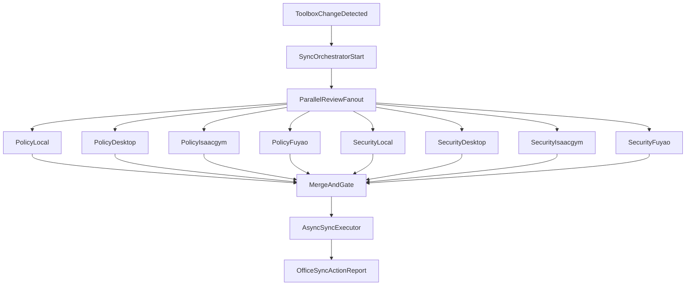

# Parallel Sync Orchestration Upgrade

## Objective

Implement an auto-invoked orchestration layer after toolbox changes (`rules`, `commands`, `skills`, `scripts`) that:
- fans out review subagents in parallel for all 4 machines (local + 3 remotes),
- gates sync execution on review outcomes,
- runs asynchronous sync execution for approved targets,
- returns a concise final report (`Office Sync Action`) in 1-2 sentences.

## Scope and Target Files

- Update orchestrator behavior in [sync-orchestrator.md](/Users/HanHu/.cursor/agents/sync-orchestrator.md)
- Update host-policy logic/output contract in [remote-policy-reviewer.md](/Users/HanHu/.cursor/agents/remote-policy-reviewer.md)
- Keep security contract aligned in [security-reviewer.md](/Users/HanHu/.cursor/agents/security-reviewer.md)
- Wire post-change trigger in [SKILL.md](/Users/HanHu/.cursor/skills/sync-after-skill-create/SKILL.md)
- Extend sync execution plumbing in [sync_toolbox.sh](/Users/HanHu/.cursor/scripts/sync_toolbox.sh) (for approved-target apply path + concise reporting)
- Optionally add a host profile source (recommended): `~/.cursor/config/host-purpose.yaml` for machine context

## Machine Purpose Context (Authoritative)

- `local`: Primary interaction/control machine; used day-to-day to access and orchestrate other machines over SSH.
- `huh.desktop.us`: Remote desktop host primarily for visualization workflows.
- `isaacgym`: Docker/container environment hosted on `huh.desktop.us`; specialized runtime for gym/visualization execution.
- `Huh8.remote_kernel.fuyao`: Remote Docker/container target used primarily for FUYAO training runs and deployment pushes.

## Planned Design

1. **Triggering**
- `sync-after-skill-create` detects toolbox changes and automatically invokes `SyncOrchestrator` (no manual `/sync-toolbox` required).

2. **Parallel review fanout (4 machines)**
- Spawn 8 reviewers in parallel:
  - `RemotePolicyReviewer` x4 (local, `huh.desktop.us`, `isaacgym`, `Huh8.remote_kernel.fuyao`)
  - `SecurityReviewer` x4 (same targets; machine-scoped context)
- Each reviewer returns strict YAML with `decision` and `required_changes`.

3. **Gate + decision merge**
- Per machine gate rule:
  - any security `block` => machine excluded and surfaced as blocker
  - policy `skip` => excluded
  - policy/security `prompt` => requires user confirmation before execute
  - both approve/pass => machine approved
- If zero approved machines, skip apply and return report.

4. **Async execution phase**
- Build approved target set and run async sync operations per target (parallelized copy/apply path).
- Preserve current conflict-resolution model; only execute operations for approved machines.
- Continue on unreachable targets and include them in final counts.

5. **Brief final report format**
- Add deterministic short output:
  - `Office Sync Action: Synced to <targets>. <n> hosts blocked/skipped.`
- Keep this to 1-2 sentences, plus optional machine detail list when needed.

## Policy Reviewer Upgrade Plan

Enhance `RemotePolicyReviewer` to produce actionable, machine-purpose-based recommendations:
- Add explicit machine context fields in output (e.g., `host_role`, `environment_constraints`, `compatibility_reason`).
- Require `required_changes` to be concrete edit guidance for tools/rules/commands/skills (not generic warnings).
- Add decision rubric per host purpose:
  - `local`: permit orchestration, SSH helpers, and cross-host tooling defaults.
  - `huh.desktop.us`: permit visualization-oriented assets; flag training/deploy-only automation as `prompt/skip`.
  - `isaacgym`: permit container/gym runtime assets; flag desktop-only or host-bound assumptions unless container-safe.
  - `Huh8.remote_kernel.fuyao`: permit training and deployment automation; flag visualization-only coupling unless explicitly needed.
- Add host-aware recommendation templates:
  - rules: split global rules from host-only rules.
  - commands: parameterize host-specific paths and runtime dependencies.
  - skills: add host guards/branching logic where behavior differs.
  - scripts: require alias-based routing and environment checks.
- Normalize confidence scoring and severity thresholds so orchestrator merging is deterministic.

## Execution Flow

## Validation Plan

- Dry-run with synthetic toolbox changes affecting each category.
- Verify parallel reviewer fanout includes all 4 machines.
- Verify blocked/prompt/skip logic excludes targets correctly.
- Verify approved-only sync execution path and unreachable handling.
- Verify final `Office Sync Action` line is always present and concise.