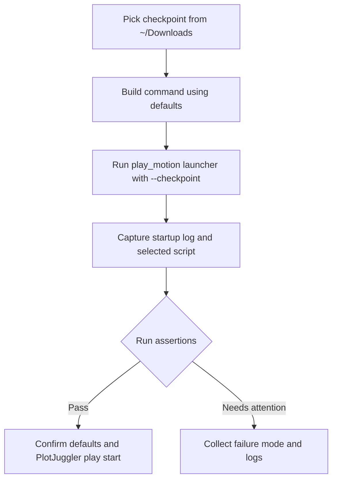

## Scope

Update and run a verification pass that uses the existing defaults in `~/.cursor/scripts/play_motion_rl.sh` without changing files.

## File and command references

- `[~/.cursor/scripts/play_motion_rl.sh](/Users/HanHu/.cursor/scripts/play_motion_rl.sh)`: current defaults are already set to `TASK=r01_v12_amp_with_4dof_arms_and_head_full_scenes`, `LAYOUT=${REMOTE_WORKDIR}/humanoid-gym/datasets/tool/config/r01_plotjuggler_full.xml`, and `INTERACTIVE=1`.
- `[~/.cursor/scripts/play_motion_rl.sh](/Users/HanHu/.cursor/scripts/play_motion_rl.sh)` launch path for checkpoints is around the `Resolve checkpoint` section and local file upload block.
- `[~/.cursor/commands/play-motion-rl.md](/Users/HanHu/.cursor/commands/play-motion-rl.md)` shows current usage defaults and required arguments.
- `[/Users/HanHu/software/motion_rl/humanoid-gym/tests/test_plotjuggler_xml_signals.py](/Users/HanHu/software/motion_rl/humanoid-gym/tests/test_plotjuggler_xml_signals.py)` can be used as a quick offline compatibility check if you also want local validation.

## Execution plan

1. Select latest checkpoint in `~/Downloads` (most recent `*.pt`) and use it as the `--checkpoint` value.
2. Run `bash ~/.cursor/scripts/play_motion_rl.sh --checkpoint <latest_checkpoint_path>` and wait for launch logs.
3. Confirm output shows:
   - task is `r01_v12_amp_with_4dof_arms_and_head_full_scenes` (default when `--task` is omitted),
   - layout path resolves to `r01_plotjuggler_full.xml`,
   - interactive play branch is used (`play_interactive.py`).
4. If needed for stronger regression coverage, run a paired offline test: `cd /Users/HanHu/software/motion_rl/humanoid-gym && python3 -m pytest tests/test_plotjuggler_xml_signals.py -k full`.
5. Report pass/fail with any launcher, checkpoint upload, PlotJuggler, or script selection errors.
