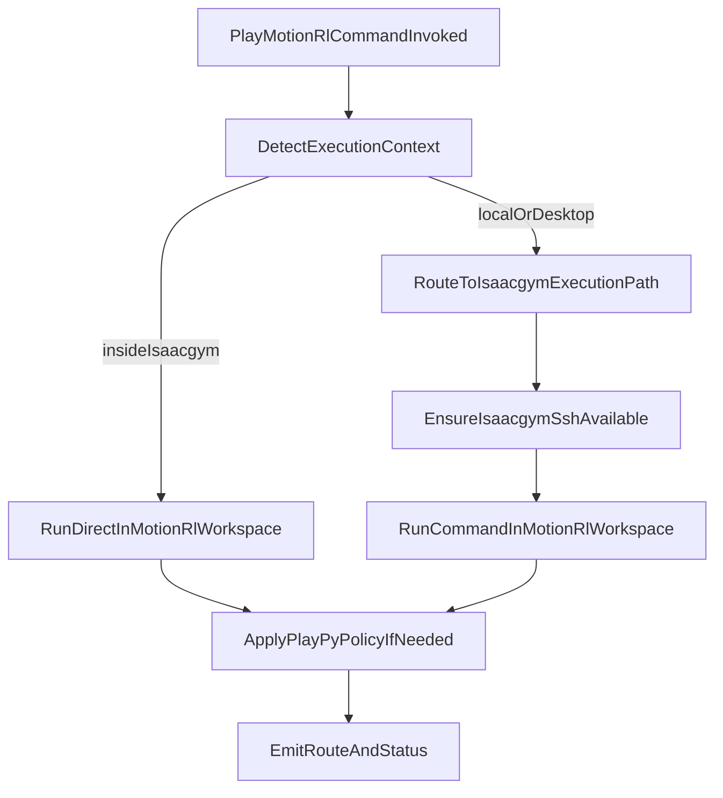

# Convert Motion RL Skill To Command

## Goal

Create a command `/play-motion-rl` that preserves existing Motion RL execution behavior, auto-detects runtime context, and routes execution correctly for local, host, and container environments.

## Files To Update

- Add command: [~/.cursor/commands/play-motion-rl.md](/Users/HanHu/.cursor/commands/play-motion-rl.md)
- Add reusable runner: [~/.cursor/scripts/play_motion_rl.sh](/Users/HanHu/.cursor/scripts/play_motion_rl.sh)
- Reuse existing helper: [~/.cursor/skills/motion-rl-isaacgym-exec/scripts/run-in-isaacgym-motion-rl.sh](/Users/HanHu/.cursor/skills/motion-rl-isaacgym-exec/scripts/run-in-isaacgym-motion-rl.sh)
- Reuse SSH ensure helper: [~/.cursor/skills/isaacgym-ssh-recovery/scripts/ensure-isaacgym-ssh.sh](/Users/HanHu/.cursor/skills/isaacgym-ssh-recovery/scripts/ensure-isaacgym-ssh.sh)

## Planned Behavior

1. **Auto-detect context**

- Detect whether execution is:
  - local control machine,
  - `huh.desktop.us` host,
  - inside `isaacgym` container.
- Routing policy:
  - inside container: run command directly in Motion RL workspace.
  - local/host: route into `isaacgym` execution path automatically.

1. **Preserve current Motion RL defaults**

- Workspace remains `/home/huh/software/motion_rl`.
- Keep existing runner-style quoting/escaping behavior.
- Keep SSH auto-heal via ensure script before remote execution.

1. **Preserve `play.py` policy from skill**

- For `humanoid-gym/humanoid/scripts/play.py` only:
  - auto-append defaults when absent: `DISPLAY=:1`, `--resume`, `--total_steps 100000000`.
  - require/provide prompts for `--task` and `--load_run` if missing.
  - default to GPU behavior unless user explicitly requests CPU.

1. **Command UX contract**

- `/play-motion-rl <args...>` executes command with clear route logging.
- Include concise output line showing route used (direct-container vs ssh-routed).
- If route preconditions fail (SSH/container unavailable), return immediate remediation hint.

1. **Post-conversion cleanup policy**

- Keep skill scripts for compatibility unless explicitly removed.
- Optionally deprecate skill file text later, but command becomes primary entrypoint.

## Execution Flow

## Validation Plan

- Test from local machine: command auto-routes and runs in `isaacgym` workspace.
- Test from `huh.desktop.us`: command auto-routes and runs in `isaacgym` workspace.
- Test from inside `isaacgym`: command runs directly without SSH re-route.
- Test `play.py` defaults/prompt behavior and verify required args handling.
- Sync updated command/scripts with `/sync-toolbox` after changes.

