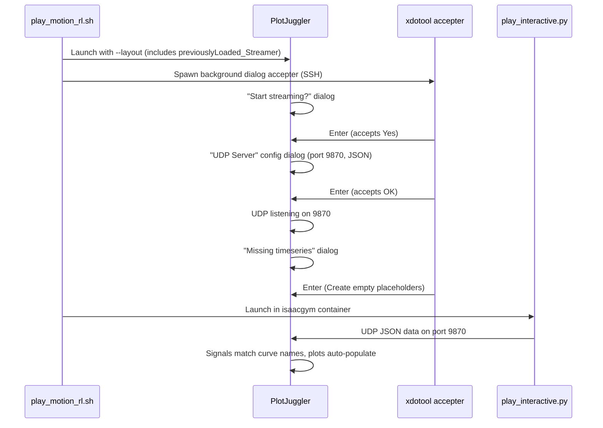

# PlotJuggler Auto-Start Streaming for /play-motion-rl

## Root cause

The current layout XML ([`r01_plotjuggler_full.xml`](r01_plotjuggler_full.xml)) does not include a `<previouslyLoaded_Streamer>` element. Without it, PlotJuggler loads the layout with curve references (e.g. `/learning/rl_obs_unscaled/gravity_vec_in_pelvis/x`) but never starts UDP listening. The user must manually navigate Streaming -> Start: UDP Server. By the time streaming starts, the layout's curves are already in a disconnected state and don't retroactively bind to incoming signals -- this is why "fields don't auto-fill."

## Key findings from PlotJuggler source code

- When `<previouslyLoaded_Streamer name="UDP Server"/>` is in the layout XML, PlotJuggler shows **three sequential dialogs** on load:
  1. **"Start streaming?"** (QMessageBox Yes/No) -- Yes is default
  2. **"UDP Server"** config dialog (port/protocol) -- pre-fills from QSettings (port 9870, protocol JSON), OK is default
  3. **"Missing timeseries"** (curves reference signals not yet present) -- **"Create empty placeholders" is the default button** (verified in [mainwindow.cpp line 996](https://github.com/facontidavide/PlotJuggler/blob/main/plotjuggler_app/mainwindow.cpp))
- PlotJuggler does **not** support headless/auto-accept for these dialogs (open issue [#201](https://github.com/facontidavide/PlotJuggler/issues/201) since 2019, unmerged PRs)
- All three dialogs can be accepted by pressing **Enter** (default buttons are all correct)

## Changes

### 1. Fix `DEFAULT_LAYOUT` path in [`~/.cursor/scripts/play_motion_rl.sh`](~/.cursor/scripts/play_motion_rl.sh)

The script currently points to `${REMOTE_WORKDIR}/humanoid-gym/datasets/tool/config/r01_plotjuggler_full.xml`, but the file actually lives at the workspace root:

```bash
# current (broken path)
DEFAULT_LAYOUT="${REMOTE_WORKDIR}/humanoid-gym/datasets/tool/config/r01_plotjuggler_full.xml"
# fixed
DEFAULT_LAYOUT="${REMOTE_WORKDIR}/r01_plotjuggler_full.xml"
```

### 2. Add `previouslyLoaded_Streamer` to layout XML [`r01_plotjuggler_full.xml`](r01_plotjuggler_full.xml)

Insert between the existing `<previouslyLoaded_Datafiles/>` and `<customMathEquations/>` elements (after line 328):

```xml
<previouslyLoaded_Datafiles/>
<previouslyLoaded_Streamer name="UDP Server"/>
<customMathEquations/>
```

### 3. Add xdotool dialog auto-accepter in `play_motion_rl.sh`

After PlotJuggler launches (step 7), spawn a background process **on the remote host** that auto-accepts all three dialogs:

- Runs via `ssh huh.desktop.us "nohup bash -c '...' &>/dev/null &"` so it doesn't block and survives script exit
- Polls with `DISPLAY=:1 xdotool search --pid ${PJ_PID}` every 1 second for up to 30 seconds
- Sends `Enter` key to each dialog window found (skipping the main PlotJuggler window)
- Includes an xdotool availability check at script start; prints a warning with install instructions if missing, and falls back to the current manual flow
- Fallback: if xdotool not found by PID, try searching by window name ("UDP Server", "Warning")

### 4. Remove manual streaming instructions from `play_motion_rl.sh`

Remove the "Next step: In PlotJuggler: Streaming -> Start: UDP Server" messages from both the SUCCESS banner (lines 308-310) and the REFRESH banner (lines 243-245). Replace with a note that streaming auto-started.

### 5. Update [`~/.cursor/commands/play-motion-rl.md`](~/.cursor/commands/play-motion-rl.md)

- Step 5: Remove the manual streaming instruction
- Remove or soften the "Plots may need manual signal drag" note (signal names are verified correct)

### 6. Sync layout to remote

Since `r01_plotjuggler_full.xml` is currently untracked, the modified layout must reach the remote. Either:

- SCP the modified file to the remote as part of the script (add SCP for default layout when it exists locally), or
- Commit the file and git pull on the remote

## Expected flow after changes


