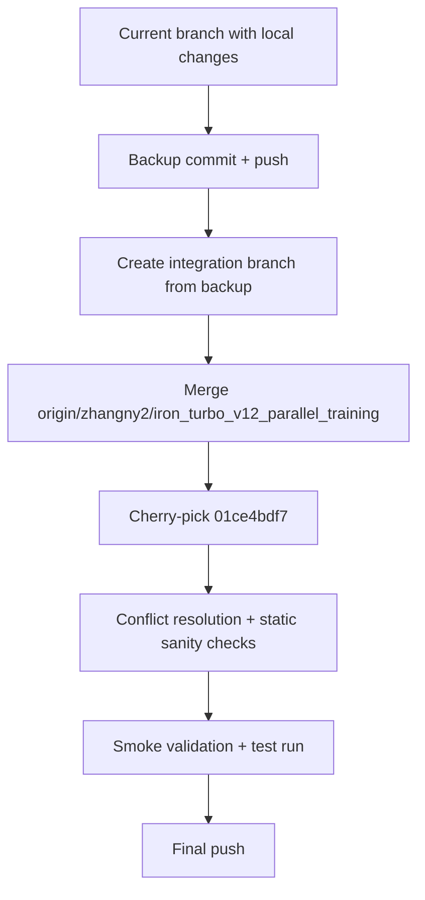

## Assumptions
- You want both changes applied: distributed training support (`--distributed`, `Accelerator` launch path) plus timeout staleness fix (`time_outs` ordering in env resets).
- `origin/zhangny2/iron_turbo_v12_parallel_training` contains the distributed training implementation and `01ce4bdf7` (on `origin/zhangny2/fix/stale_time_out`) is the timeout fix commit.

## Targeted flow

## Action plan
1. **Preserve current work first**
- Create a safety commit containing your current workspace state and push it to your branch.
- Keep this commit hash as the rollback anchor.
- Optional hardening: create a local restore branch at this hash.

2. **Prepare an integration branch**
- Start from the backup tip and create `integrate/zhangny2-parallel-timeout` (or your preferred name).
- Fetch latest remote refs and inspect remote branch presence before merge.

3. **Apply parallel-training changes**
- Merge `origin/zhangny2/iron_turbo_v12_parallel_training` into the integration branch.
- This is the change set with distributed trainer, launcher, and task registry wiring.
- Expected touched areas include:
  - [`humanoid-gym/humanoid/scripts/train.py`](humanoid-gym/humanoid/scripts/train.py)
  - [`humanoid-gym/humanoid/utils/helpers.py`](humanoid-gym/humanoid/utils/helpers.py)
  - [`humanoid-gym/humanoid/utils/task_registry.py`](humanoid-gym/humanoid/utils/task_registry.py)
  - [`humanoid-gym/humanoid/algo/iron_turbo/core.py`](humanoid-gym/humanoid/algo/iron_turbo/core.py)
  - [`humanoid-gym/humanoid/algo/amp_ppo/amp_ppo.py`](humanoid-gym/humanoid/algo/amp_ppo/amp_ppo.py)
  - [`humanoid-gym/scripts/fuyao_train.sh`](humanoid-gym/scripts/fuyao_train.sh)
  - [`humanoid-gym/scripts/fuyao_deploy.sh`](humanoid-gym/scripts/fuyao_deploy.sh)

4. **Apply timeout fix cleanly**
- Cherry-pick the single timeout commit `01ce4bdf7` from `origin/zhangny2/fix/stale_time_out`.
- This is a targeted fix expected only in timeout-related env files:
  - [`humanoid-gym/humanoid/envs/base/legged_robot.py`](humanoid-gym/humanoid/envs/base/legged_robot.py)
  - [`humanoid-gym/humanoid/envs/px5_amp/px5_amp_env.py`](humanoid-gym/humanoid/envs/px5_amp/px5_amp_env.py)
  - [`humanoid-gym/humanoid/envs/r01_amp/r01_amp_env.py`](humanoid-gym/humanoid/envs/r01_amp/r01_amp_env.py)
  - [`humanoid-gym/humanoid/envs/r01_amp/r01_amp_teleop_env.py`](humanoid-gym/humanoid/envs/r01_amp/r01_amp_teleop_env.py)
  - [`humanoid-gym/humanoid/envs/r01_mimic/r01_mimic_env.py`](humanoid-gym/humanoid/envs/r01_mimic/r01_mimic_env.py)

5. **Resolve conflicts with deterministic order**
- Prioritize preserving current setup around training script argument handling and any in-flight local changes.
- Keep `timeout` patch semantics from `01ce4bdf7` (timeout extras must be set before early-return path).

6. **Validate before final push**
- Confirm distributed flags and flow:
  - `--distributed` in `helpers.py`
  - `train.py` uses `Accelerator`, `args.distributed`, and `destroy_process_group` handling
  - `fuyao_deploy.sh` / `fuyao_train.sh` propagate `--distributed`, `--nnodes`, `--nproc_per_node`
  - `task_registry` passes accelerator into runner
- Confirm timeout ordering in all five env files (extras assignment before `if len(env_ids) == 0:` in `reset_idx`).
- Run at least one short distributed launch smoke test and one non-distributed baseline run.

7. **Push final result**
- Push integration branch to remote.
- If this branch passes checks, optionally open/rebase onto your original branch by your team’s preferred policy.
