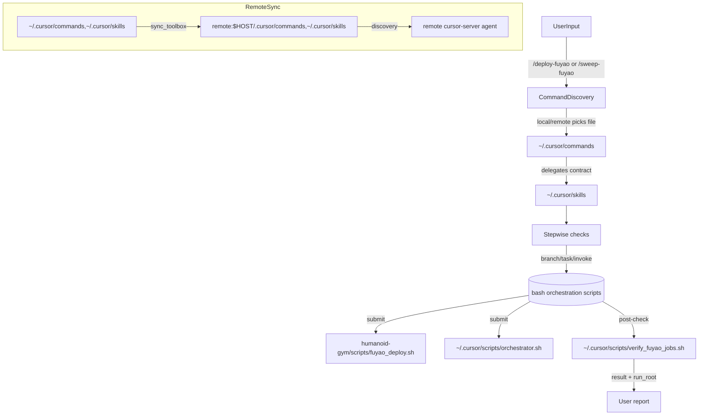

# Reliable Fuyao Invocation Plan

## Why this plan

- Skill files are instruction documents; strict execution should be anchored in shell scripts.
- Keeping commands thin and synchronized across local + remote `.cursor` paths improves discoverability and repeatability.

## Target files

- [~/.cursor/commands/deploy-fuyao.md](~/.cursor/commands/deploy-fuyao.md)
- [~/.cursor/commands/sweep-fuyao.md](~/.cursor/commands/sweep-fuyao.md)
- [~/.cursor/skills/checkout-for-huh8/SKILL.md](~/.cursor/skills/checkout-for-huh8/SKILL.md)
- [~/.cursor/skills/commit-tag-prefix/SKILL.md](~/.cursor/skills/commit-tag-prefix/SKILL.md)
- [~/.cursor/scripts/orchestrator.sh](~/.cursor/scripts/orchestrator.sh)
- [~/.cursor/scripts/verify_fuyao_jobs.sh](~/.cursor/scripts/verify_fuyao_jobs.sh)
- [~/.cursor/scripts/sync_toolbox.sh](~/.cursor/scripts/sync_toolbox.sh)
- [~/.cursor-server/data](~/.cursor-server/data) (verification only, for discovery logs)

## Plan

- Add new `[~/.cursor/skills/deploy-fuyao/SKILL.md](~/.cursor/skills/deploy-fuyao/SKILL.md)` as the canonical deploy contract.
- Keep this skill authoritative by moving all execution constraints there.
- Require exact steps: mandatory inputs, task validation, branch/source control, and explicit execution command.
- Require confirmation before running any remote SSH submit in `deploy-fuyao` and before sweep dispatch.
- Add a tiny fallback block in each command file: if skill interpretation is unclear, show the exact canonical command for manual execution.
- Add new `[~/.cursor/skills/sweep-fuyao/SKILL.md](~/.cursor/skills/sweep-fuyao/SKILL.md)` with the same pattern as the existing `sweep-fuyao.md` command.
- Keep command files as discovery-friendly shims that mirror both invocation and defaults while delegating to the skill's contract.
- Migrate from prose-only behavior to a predictable sequence: parse -> confirm -> build payload -> execute script -> verify.
- Use `/bin/bash` command templates from `~/.cursor/scripts/orchestrator.sh` and `humanoid-gym/scripts/fuyao_deploy.sh` with explicit arguments.
- Sync both `commands` and `skills` to remote assets using `~/.cursor/scripts/sync_toolbox.sh` so remote sessions load from `~/.cursor/commands` and `~/.cursor/skills`.
- Confirm remote runtime by checking both paths on remote alias and reloading cursor-server session.
- Add a short post-action check: command parsed, script exit code, and output artifact (`run_root` for sweep).
- If remote still cannot discover:
  - clear only Cursor user-level caches locally, then restart the remote extension host.
  - inspect `~/.cursor-server/data/logs/*/anysphere.cursor-retrieval/Cursor\ Indexing\ \&\ Retrieval.log` for `NoWorkspaceUriError`.

## Reliability diagram

## Action items

- Create the two new SKILL files with strict gate checks and command templates.
- Update both command files into thin wrappers that stay stable under discovery.
- Run toolbox sync to `huh.desktop.us` and `remote.kernel.fuyo`.
- Verify discoverability in remote session and test one non-submitting dry path.
- Add a post-run checklist for branch/task, job status, and cancellation path.
