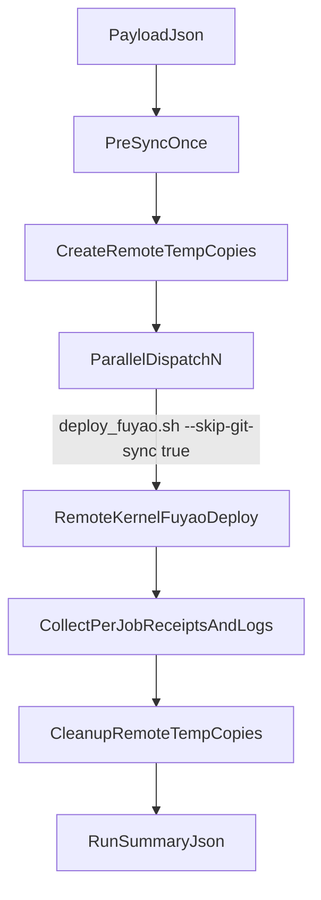

# Remote-Kernel Parallel Wrapper Plan

## Scope

- Keep the command target at [deploy-fuyao command](/home/huh/.cursor/commands/deploy-fuyao.md).
- Refactor the thin wrapper at [parallel wrapper](/home/huh/.cursor/scripts/fuyao_deploy_parallel_wrapper.py) to dispatch **Cursor deploy helper** calls, not `humanoid-gym/scripts/fuyao_deploy.sh`.

## Implementation Steps

- Back up [deploy-fuyao command](/home/huh/.cursor/commands/deploy-fuyao.md) to a timestamped backup file under `~/.cursor/commands/` before any edits.
- Update [parallel wrapper](/home/huh/.cursor/scripts/fuyao_deploy_parallel_wrapper.py) defaults and payload contract to target [Cursor deploy helper](/home/huh/.cursor/scripts/deploy_fuyao.sh).
- Add a **pre-sync stage** (run once): sync local branch to origin, then sync remote root to the chosen branch (single baseline pass).
- Add **remote temp-copy stage** per run: create unique remote worktree directories (or temp repo copies) off the synced branch for each job.
- Change per-job dispatch command generation so each parallel call invokes [Cursor deploy helper](/home/huh/.cursor/scripts/deploy_fuyao.sh) with:
  - `--remote-root <job_temp_remote_root>`
  - `--skip-git-sync true`
  - original job-specific deploy args.
- Add run artifact fields for traceability: remote temp root path, sync stage result, full per-job command preview, and cleanup outcome.
- Add post-run cleanup for temp remote worktrees/copies (with optional `keep_remote_temp=true` override for debugging).
- Update [payload example](/home/huh/.cursor/scripts/fuyao_deploy_parallel_wrapper.payload.example.json) to reflect new remote-kernel wrapper usage.
- Update [deploy-fuyao command](/home/huh/.cursor/commands/deploy-fuyao.md) to document invocation and behavior of the upgraded thin wrapper.

## Dispatch Flow

## Validation Plan

- Dry-run validation: confirm generated per-job commands point to [Cursor deploy helper](/home/huh/.cursor/scripts/deploy_fuyao.sh) and include `--skip-git-sync true` + unique `--remote-root`.
- Live canary: dispatch 2 identical runs in parallel; verify both job names are emitted and both were submitted from remote-kernel path.
- Regression check: ensure single-run behavior still works and command docs remain accurate.
