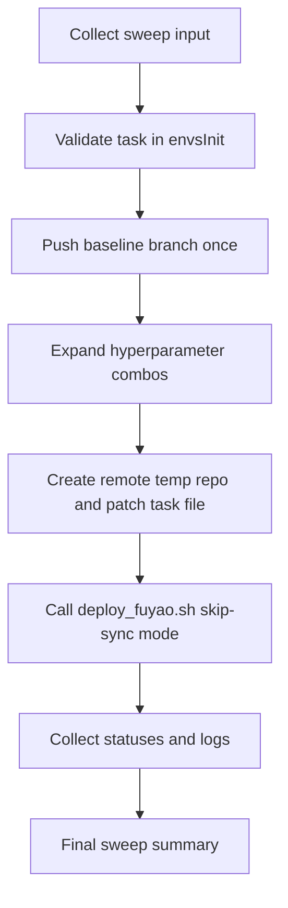

# Remote-Kernel Sweep Orchestration Plan

## Goal

Implement a sweep orchestrator that validates task registration, creates per-combo temporary remote repos, patches hard-coded hyperparameters in task files, and submits Fuyao jobs in parallel without creating many origin branches.

## Key Design Decisions

- Keep `deploy_fuyao.sh` as the structured deploy interface, but add a **remote-exec mode** that skips local push/sync steps.
- Run sweep mutation + submission on remote kernel only.
- Validate task existence from [`/home/huh/software/motion_rl/humanoid-gym/humanoid/envs/__init__.py`](/home/huh/software/motion_rl/humanoid-gym/humanoid/envs/__init__.py) before launching jobs.

## Files To Change

- [`/home/huh/.cursor/scripts/orchestrator.sh`](/home/huh/.cursor/scripts/orchestrator.sh) (new)
- [`/home/huh/.cursor/scripts/deploy_fuyao.sh`](/home/huh/.cursor/scripts/deploy_fuyao.sh) (extend with remote-exec mode)

## Implementation Steps

1. Extend `deploy_fuyao.sh` with a mode (for example `--skip-git-sync true`) that:
   - skips local dirty-tree checks, local push, and remote `reset --hard origin/<branch>`
   - only performs SSH connectivity + final remote `fuyao deploy ...` command composition/execution
   - preserves existing argument schema/formatting so orchestrator can reuse it consistently
2. Create `orchestrator.sh` interactive flow to collect:
   - base deploy args (`task`, experiment/queue/resources, label prefix, dry-run, max parallelism)
   - hyperparameter sweep definitions as patch rules against hard-coded values in task file(s)
3. Add preflight validation in `orchestrator.sh`:
   - confirm provided task is registered in `humanoid-gym/humanoid/envs/__init__.py`
   - validate patch targets/rules are parseable and non-empty
4. Implement remote temp-repo workflow per combo:
   - push current branch once (single baseline)
   - on remote, create a per-combo work directory/repo copy from baseline
   - patch hyperparameters in the combo-specific task file(s)
   - call `deploy_fuyao.sh` in skip-sync mode for submission
5. Run combo submissions in bounded parallel workers:
   - one worker per combo, capped by `max_parallel`
   - per-combo logs + exit codes
   - continue-on-error mode with final failure summary
6. Print final report:
   - total combos, submitted/succeeded/failed
   - per-combo label + log path
   - exact rerun command for failed combos

## Flow

## Acceptance Criteria

- Orchestrator blocks if task is not found in `envs/__init__.py` registrations.
- Sweep can submit many combos without pushing one branch per combo.
- Hyperparameters are patched in remote temp repos only, leaving local repo clean.
- Deploy submission still uses `deploy_fuyao.sh` argument structure.
- Parallel execution is capped and a clear success/failure summary is produced.
