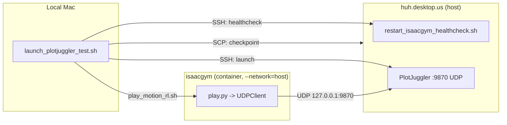

# Reproducible PlotJuggler Test Launcher

## Architecture

The orchestrator runs locally on the Mac, coordinating two remote processes:




## Changes

No existing scripts or repo files are modified. Two new cursor toolbox files are created.

### 1. Create orchestrator script

File: `~/.cursor/scripts/launch_plotjuggler_test.sh`

Self-contained script that handles play.py defaults internally (bypasses `play_motion_rl.sh` to avoid its `--load_run` requirement). Uses `run-in-isaacgym-motion-rl.sh` directly for container command execution.

**Usage:**

```
bash ~/.cursor/scripts/launch_plotjuggler_test.sh \
  --task <task_name> \
  --checkpoint <local_or_remote_path> \
  [--layout <remote_xml_path>] \
  [--total_steps <n>]
```

**Parameters:**

- `--task` (required): task name from the registry (e.g. `r01_v12_amp_with_4dof_arms_and_head_full_scenes`)
- `--checkpoint` (required): path to `.pt` file. If it exists locally on Mac, auto-SCPs to remote. If it's a remote path, validates it exists via SSH.
- `--layout`: PlotJuggler layout XML path on the remote host. Default: `~/software/motion_rl/humanoid-gym/datasets/tool/config/r01_plus_amp_plotjuggler_limit_inspect.xml`
- `--total_steps`: default `100000000`

**Orchestration steps:**

1. Parse and validate args (`--task` and `--checkpoint` required)
2. Container healthcheck: `ssh huh.desktop.us "bash ~/.cursor/scripts/restart_isaacgym_healthcheck.sh"`. Exit on failure.
3. Resolve checkpoint:
  - Local file (exists on Mac): `scp <path> huh.desktop.us:~/software/motion_rl/` -> `REMOTE_CKPT=/home/huh/software/motion_rl/<basename>`
  - Remote path: `ssh huh.desktop.us "test -f <path>"` to validate -> `REMOTE_CKPT=<path>`
4. Kill existing PlotJuggler: `ssh huh.desktop.us "pkill -f plotjuggler 2>/dev/null || true"`
5. Launch PlotJuggler: `ssh huh.desktop.us "DISPLAY=:1 nohup plotjuggler --nosplash --layout <layout> > /tmp/plotjuggler.log 2>&1 &"`. Poll `pgrep` for up to 5s. Check `/tmp/plotjuggler.log` for crashes.
6. Launch play.py via skill runner (not `play_motion_rl.sh`): `bash ~/.cursor/skills/motion-rl-isaacgym-exec/scripts/run-in-isaacgym-motion-rl.sh DISPLAY=:1 python humanoid-gym/humanoid/scripts/play.py --task <task> --checkpoint_path <REMOTE_CKPT> --resume --total_steps <n>`. Run in background, poll for process.
7. Print summary: PIDs, paths, and manual UDP Server start instruction (Streaming -> Start: UDP Server, port 9870, JSON).

**Key constraints:**

- PlotJuggler executable: `plotjuggler` (snap-installed)
- DISPLAY: `:1` (physical display on huh.desktop.us)
- No `--publish` flag (causes crash)
- play.py defaults (`DISPLAY=:1`, `--resume`, `--total_steps`) applied by the script itself

### 2. Create Cursor command

File: `~/.cursor/commands/launch-plotjuggler-test.md`

Slash command `/launch-plotjuggler-test` instructs the agent to:

1. Collect `--task` and `--checkpoint` from the user if not provided
2. Run `bash ~/.cursor/scripts/launch_plotjuggler_test.sh` with the arguments (backgrounded for play.py)
3. Monitor output, report pass/fail for each step
4. Remind user to start UDP Server in PlotJuggler

### 3. Sync toolbox (per workspace rules)

After creating both files, sync to remote hosts per the `sync-toolbox-after-toolbox-edits` rule.
