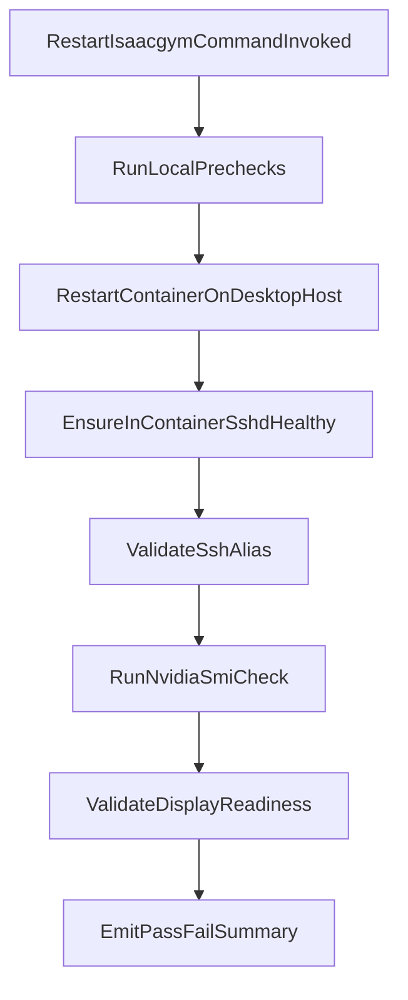

# Convert IsaacGym Recovery Skill To Command

## Goal

Replace the current skill-style workflow with a command named `/restart-isaacgym` that, when run locally, executes a dual local+remote flow and restarts the `isaacgym` Docker container on `huh.desktop.us`, then validates that SSH, GPU, and display prerequisites are healthy.

## Target Files

- Create command: [/Users/HanHu/.cursor/commands/restart-isaacgym.md](/Users/HanHu/.cursor/commands/restart-isaacgym.md)
- Reuse/update script: [/Users/HanHu/.cursor/skills/isaacgym-ssh-recovery/scripts/recover-isaacgym-ssh.sh](/Users/HanHu/.cursor/skills/isaacgym-ssh-recovery/scripts/recover-isaacgym-ssh.sh)
- Reuse/update script: [/Users/HanHu/.cursor/skills/isaacgym-ssh-recovery/scripts/ensure-isaacgym-ssh.sh](/Users/HanHu/.cursor/skills/isaacgym-ssh-recovery/scripts/ensure-isaacgym-ssh.sh)
- Optional helper script (if needed for clarity): `~/.cursor/scripts/restart_isaacgym_healthcheck.sh`

## Planned Behavior

1. **Restart flow**

- Restart container on jump host (`huh.desktop.us`): stop (best-effort), start, confirm running state.
- Re-run current SSH bootstrap (`sshd` in-container on `22022`) so `ssh isaacgym` remains usable.

1. **Dual execution behavior (new requirement)**

- If `/restart-isaacgym` is invoked on local:
  - perform local-side prechecks (alias reachability and command prerequisites),
  - execute remote restart + health checks on `huh.desktop.us`,
  - return one merged pass/fail summary covering both local and remote steps.
- If invoked directly on `huh.desktop.us`, execute restart + health checks there.

1. **Quick validation checks (selected scope)**

- **SSH check:** `ssh isaacgym "hostname && whoami"`
- **GPU check:** run `nvidia-smi` inside container and require successful exit.
- **Display readiness check:** verify display-related prerequisites inside container:
  - `DISPLAY` is set (or default to expected value)
  - X11 socket path exists (for example `/tmp/.X11-unix` and at least one `X`* socket)

1. **Result reporting**

- Print one compact status block with pass/fail for:
  - local prechecks
  - container restart
  - SSH
  - GPU
  - display readiness
- If any check fails, return failed status and a short next-step hint.

1. **Command contract**

- `/restart-isaacgym` performs restart + validations in one run.
- Keep defaults compatible with current aliases and container name:
  - jump host: `huh.desktop.us`
  - container: `isaacgym`
  - ssh alias: `isaacgym`
  - ssh port: `22022`

## Data Flow

## Validation Plan

- Run `/restart-isaacgym` once and confirm all four checks report pass.
- Simulate one failure mode (for example invalid SSH alias) and confirm command reports targeted failure output.
- Verify no regressions for existing `ssh isaacgym` proxy behavior.
- If command/scripts changed, run `/sync-toolbox` to propagate to remote machines.

