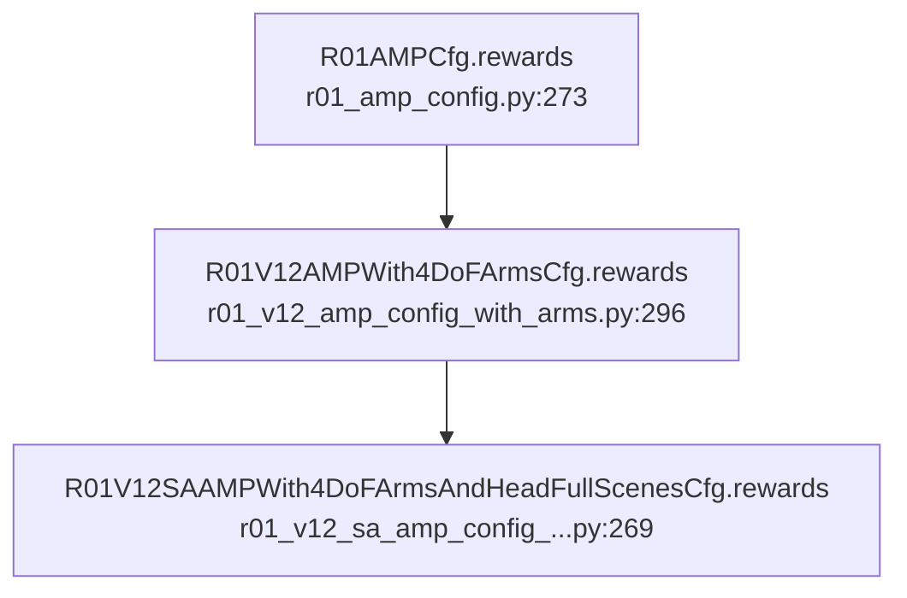

# Reward Design Analysis and Stability-Priority Tuning Plan

## 1. File Trace from Line 188

The task registered at line 188 of `[humanoid-gym/humanoid/envs/__init__.py](humanoid-gym/humanoid/envs/__init__.py)`:

```python
task_registry.register(
    "r01_v12_sa_amp_with_4dof_arms_and_head_full_scenes",
    R01V12AMPEnv,                                          # env class
    R01V12SAAMPWith4DoFArmsAndHeadFullScenesCfg(),          # env config
    R01V12SAAMPWith4DoFArmsAndHeadFullScenesCfgPPO(),       # PPO config
)
```

### Reward Config File (the "reward file")

**Primary file:** `[humanoid-gym/humanoid/envs/r01_amp/r01_v12_sa_amp_config_with_arms_and_head_full_scenes.py](humanoid-gym/humanoid/envs/r01_amp/r01_v12_sa_amp_config_with_arms_and_head_full_scenes.py)` -- lines 269-284

**Inheritance chain for `rewards`:**



### Reward Implementation Files

- **R01AMPEnv** (base reward methods): `[humanoid-gym/humanoid/envs/r01_amp/r01_amp_env.py](humanoid-gym/humanoid/envs/r01_amp/r01_amp_env.py)` -- lines 1036-1199
- **R01V12AMPEnv** (overrides/additions): `[humanoid-gym/humanoid/envs/r01_amp/r01_v12_amp_env.py](humanoid-gym/humanoid/envs/r01_amp/r01_v12_amp_env.py)` -- lines 109-272
- **Reward dispatch**: `[humanoid-gym/humanoid/envs/base/legged_robot.py](humanoid-gym/humanoid/envs/base/legged_robot.py)` -- `_prepare_reward_function()` at line 951

---

## 2. Total Reward Architecture (AMP + Task)

The total reward is **not** just the task reward. It is a **weighted blend** of two components:

```
total_reward = (1 - lerp) * amp_reward + lerp * task_reward
             = 0.70 * amp_reward + 0.30 * task_reward
```

Where `amp_task_reward_lerp = 0.3` (set in the PPO config at line 338).

- **AMP reward (70% weight):** Discriminator-based reward for motion naturalness/style. This implicitly encourages stable, natural-looking motion derived from reference motion clips. This is the single largest source of "stabilization" in the current setup.
- **Task reward (30% weight):** Sum of all individual reward terms (scales below).

---

## 3. Full Breakdown of All Reward Terms by Category

All scales are multiplied by `dt` at runtime. The values below are the **pre-dt config values**.

### CATEGORY A: Velocity Tracking Rewards (POSITIVE -- drive locomotion)

| Reward Term            | Scale    | Formula                                  | Purpose                              |
| ---------------------- | -------- | ---------------------------------------- | ------------------------------------ | ------------------- | --- | ------------------------- | ------------------------------- |
| `tracking_avg_lin_vel` | **+2.0** | `exp(-                                   |                                      | cmd_xy - avg_vel_xy |     | ^2 / sigma^2)`, sigma=1.0 | Track commanded linear velocity |
| `tracking_avg_ang_vel` | **+4.0** | `exp(-(cmd_yaw - avg_yaw_vel)^2 / 0.01)` | Track commanded yaw angular velocity |

**Key parameters:** `tracking_sigma_lin_vel = 1.0` (loose -- the agent is not strongly punished for velocity errors), `tracking_sigma_lin_vel_for_rotate_in_place = 0.25` (tighter for pure rotation), `tracking_sigma_ang_vel = 0.01` (very tight).

### CATEGORY B: Motion Smoothness Penalties (NEGATIVE -- regularize actions/dynamics)

| Reward Term   | Scale       | Formula                                       | Purpose                                      |
| ------------- | ----------- | --------------------------------------------- | -------------------------------------------- |
| `action_rate` | **-0.05**   | `sum((a_t - a_{t-1})^2)`                      | Penalize jerky actions                       |
| `torque_rate` | **-0.0002** | `sum(((tau_t - tau_{t-1}) / tau_lim / dt)^2)` | Penalize torque rate of change               |
| `torques`     | **-1e-8**   | `sum(tau^2)`                                  | Penalize total torque magnitude (negligible) |
| `dof_acc`     | **-2.5e-8** | `sum(((dof_vel_t - dof_vel_{t-1}) / dt)^2)`   | Penalize joint accelerations (negligible)    |

### CATEGORY C: Safety/Joint Limit Penalties (NEGATIVE -- protect hardware)

| Reward Term                              | Scale        | Formula                                                    | Purpose                                            |
| ---------------------------------------- | ------------ | ---------------------------------------------------------- | -------------------------------------------------- | --------------------------------------- | ------------------------------------------------ |
| `dof_pos_limits`                         | **-100.0**   | `sum(max(0, pos - upper_soft) + max(0, lower_soft - pos))` | Massive penalty for joint position limit violation |
| `dof_vel_limits`                         | **-1.0**     | `sum(max(0,                                                | vel                                                | - soft_vel_lim))`                       | Penalize velocity limit violation (soft_lim=0.6) |
| `hip_roll_and_ankle_pitch_torque_limits` | **-1.0**     | `sum(max(0,                                                | tau                                                | - soft_lim))` on hip roll + ankle pitch | Protect vulnerable joints                        |
| `feet_contact_forces`                    | **-0.00001** | `sum(max(0,                                                | F                                                  | - 800))`                                | Penalize extreme foot forces (negligible)        |

### CATEGORY D: Disabled Rewards (scale = 0.0, available but OFF)

| Reward Term           | Scale | What it would do                                       |
| --------------------- | ----- | ------------------------------------------------------ |
| `stand_still`         | 0.0   | Penalize joint deviation from standing pose when cmd~0 |
| `orientation`         | 0.0   | Penalize non-upright base (projected_gravity_xy)       |
| `ang_vel_xy`          | 0.0   | Penalize base roll/pitch angular velocity              |
| `lin_vel_z`           | 0.0   | Penalize vertical velocity                             |
| `base_height`         | 0.0   | Penalize deviation from target height (1.0m)           |
| `default_joint_pos`   | 0.0   | Reward being near default pose (hip yaw/roll focus)    |
| `foot_distance_limit` | 0.0   | Penalize feet too close together                       |
| `catwalk_thigh_roll`  | 0.0   | Reward catwalk-style leg motion                        |
| `torque_limits`       | 0.0   | Penalize all torques exceeding soft limits             |
| `collision`           | 0.0   | Penalize contact on penalized bodies                   |
| `energy`              | 0.0   | Penalize mechanical power                              |
| `termination`         | 0.0   | Terminal penalty on early reset                        |
| `feet_air_time`       | 0.0   | Reward longer step duration                            |
| `dof_vel`             | 0.0   | Penalize total joint velocity                          |
| `feet_vel`            | 0.0   | Penalize foot velocities                               |
| `torques_percent`     | 0.0   | Penalize torques relative to limits                    |
| `feet_stumble`        | 0.0   | Penalize feet hitting vertical surfaces                |

Additionally, `torso_ang_vel_xy_penalty` exists in the env code but has no scale entry (commented out at 0.002 in the parent).

---

## 4. Relative Importance Ranking (Active Rewards)

Ranked by **effective magnitude of influence** on the total reward (accounting for both scale magnitude and typical reward values):

| Rank   | Reward Term                              | Scale        | Role                                              | Category           |
| ------ | ---------------------------------------- | ------------ | ------------------------------------------------- | ------------------ |
| **0**  | **AMP discriminator**                    | 70% of total | Motion naturalness/stability from reference clips | Implicit stability |
| **1**  | `dof_pos_limits`                         | -100.0       | Dominates when joints approach limits             | Safety             |
| **2**  | `tracking_avg_ang_vel`                   | +4.0         | Primary yaw tracking driver                       | Velocity tracking  |
| **3**  | `tracking_avg_lin_vel`                   | +2.0         | Primary forward velocity driver                   | Velocity tracking  |
| **4**  | `dof_vel_limits`                         | -1.0         | Significant penalty for fast joint motion         | Safety             |
| **5**  | `hip_roll_and_ankle_pitch_torque_limits` | -1.0         | Protects vulnerable joints                        | Safety             |
| **6**  | `action_rate`                            | -0.05        | Smoothness regularizer                            | Smoothness         |
| **7**  | `torque_rate`                            | -0.0002      | Minor smoothness regularizer                      | Smoothness         |
| **8**  | `torques`                                | -1e-8        | Negligible                                        | Smoothness         |
| **9**  | `dof_acc`                                | -2.5e-8      | Negligible                                        | Smoothness         |
| **10** | `feet_contact_forces`                    | -0.00001     | Negligible                                        | Safety             |

---

## 5. Tuning Strategy for Stability-Priority Mode

**Goal:** When receiving zero velocity command (or explicitly), the robot should deprioritize velocity tracking and prioritize standing stably.

### Approach A: Config-Only Tuning (no code changes)

Modify `[r01_v12_sa_amp_config_with_arms_and_head_full_scenes.py](humanoid-gym/humanoid/envs/r01_amp/r01_v12_sa_amp_config_with_arms_and_head_full_scenes.py)` rewards section:

- **Enable `stand_still`**: Set `stand_still = -2.0` to actively penalize joint motion when commanded velocity is near zero. This reward is already gated on `norm(commands[:, :3]) < 0.1`.
- **Enable `orientation`**: Set `orientation = -5.0` to penalize non-upright orientation.
- **Enable `ang_vel_xy`**: Set `ang_vel_xy = -1.0` to penalize roll/pitch angular velocity of the base.
- **Enable `lin_vel_z`**: Set `lin_vel_z = -1.0` to penalize vertical bouncing.
- **Enable `base_height`**: Set `base_height = -5.0` to maintain consistent standing height.
- **Enable `default_joint_pos`**: Set `default_joint_pos = 0.5` to reward being near the standing pose.
- **Optionally reduce `tracking_avg_lin_vel`**: From 2.0 to 1.0, so velocity tracking is less dominant vs. stabilization terms.
- **Increase `amp_task_reward_lerp`**: From 0.3 to 0.5, so task reward (with new stability terms) has more weight relative to AMP.

### Approach B: Conditional Reward Logic (code changes)

Add logic in the env to dynamically suppress tracking rewards when a "stability mode" flag is set:

- Add a stability mode flag triggered by zero-velocity commands or an external signal.
- When active: zero out `tracking_avg_lin_vel` and `tracking_avg_ang_vel` reward contributions, and amplify stabilization terms.
- This could be done by modifying `compute_reward()` in the env, or by using a command-conditioned reward multiplier.

### Approach C: Two-Phase Training with Curriculum

- Phase 1: Train normally with current reward.
- Phase 2: Increase `stand_prob` from 0.07 to 0.3+, enable stabilization rewards, reduce tracking rewards. This teaches the policy to handle both locomotion and standing.

### Recommended Starting Point

For the least-invasive, most predictable tuning:

1. Enable `stand_still = -2.0`, `orientation = -3.0`, `ang_vel_xy = -0.5`, `lin_vel_z = -0.5` in the scales
2. Increase `stand_prob` in `commands.new_sample_methods` from `0.07` to `0.15-0.25`
3. Keep tracking rewards unchanged initially
4. Observe training curves; if the robot still over-prioritizes velocity tracking during stand commands, reduce `tracking_avg_lin_vel` from 2.0 toward 1.0

The key insight: `stand_still` already checks whether the command is near zero, so it naturally activates only during the "stability priority" regime. The other stability terms (`orientation`, `ang_vel_xy`, `lin_vel_z`) are always-on penalties that will improve overall stability without hurting locomotion much.
