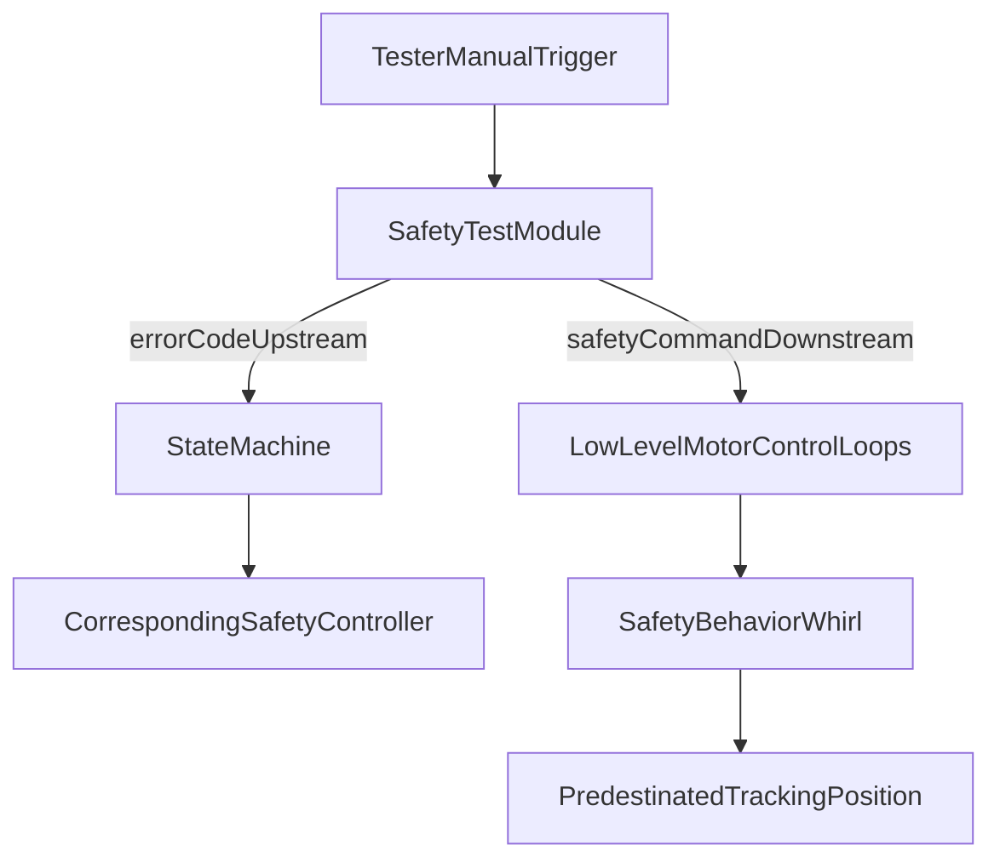

# Humanoid Robot Safety Controller Test Module Markdown

## Goal

Create a clear design document at `[/Users/HanHu/Documents/Markdown files/humanoid_robot_safety_controller_test_module.md](/Users/HanHu/Documents/Markdown files/humanoid_robot_safety_controller_test_module.md)` describing:

- Manual tester trigger behavior
- Upstream error-report signal to the state machine
- Downstream safety-behavior signal to motor control loops
- Predestinated tracking-position behavior in low-level loops

## Planned Content

- Add a concise module overview and scope.
- Define interfaces/signals:
  - `manualTrigger`
  - `errorCodeUpstream` (to state machine)
  - `safetyCommandDownstream` (to low-level actuator control loops)
- Document expected system responses:
  - State machine selects corresponding safety controller based on error.
  - Motor loops enter safety whirl behavior and move to predestinated tracking position.
- Include assumptions and test notes (e.g., trigger source, error mapping, behavior completion conditions).

## Mermaid Diagrams To Include

- **Flowchart** for end-to-end signal routing:
  - Tester -> Test Module -> (Upstream) State Machine -> Safety Controller Switch
  - Test Module -> (Downstream) Low-Level Control Loops -> Safety Whirl -> Predestinated Tracking Position
- **Sequence diagram** to show temporal order after manual trigger.

## Deliverable

- One new Markdown file with structured sections and Mermaid blocks, ready for review and iteration.

