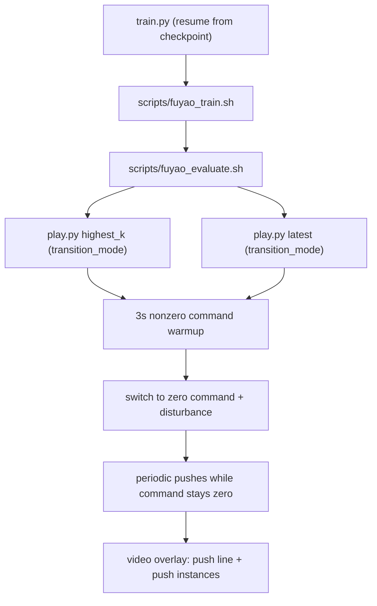

# Stability Objective Alignment Plan

## Objective (called first)

Match the task to your intended scenario: continue checkpoint-compatible training with leg-only actuation, then evaluate recovery by running a non-zero command for ~3s, abruptly switching to zero command, and applying disturbance (then periodic pushes), while avoiding reward penalties on joints/actions the policy cannot control.

## Self-Critique Findings (current implementation)

- Post-train auto-evaluation does not enable push disturbance by default in `[/Users/HanHu/software/motion_rl/humanoid-gym/scripts/fuyao_evaluate.sh](/Users/HanHu/software/motion_rl/humanoid-gym/scripts/fuyao_evaluate.sh)`.
- `--fixed_command` in `[/Users/HanHu/software/motion_rl/humanoid-gym/humanoid/scripts/play.py](/Users/HanHu/software/motion_rl/humanoid-gym/humanoid/scripts/play.py)` currently uses a mixed non-zero schedule, which does not represent the abrupt transition scenario.
- With `leg_only_control=True`, several reward terms in `[/Users/HanHu/software/motion_rl/humanoid-gym/humanoid/envs/r01_amp/r01_amp_env.py](/Users/HanHu/software/motion_rl/humanoid-gym/humanoid/envs/r01_amp/r01_amp_env.py)` still aggregate non-controlled joints/actions.
- Generated `play.py` videos do not currently visualize random-push direction lines or explicit push-event instances on screen.

## Implementation Plan

1. Update reward masking for leg-only mode in `[/Users/HanHu/software/motion_rl/humanoid-gym/humanoid/envs/r01_amp/r01_amp_env.py](/Users/HanHu/software/motion_rl/humanoid-gym/humanoid/envs/r01_amp/r01_amp_env.py)`.
  - Add a small helper to return the controlled joint/action slice when `cfg.env.leg_only_control` is enabled.
  - Apply this mask to all relevant joint/action-aggregated terms (you asked for full masking), including `action_rate`, `stand_still`, and joint-limit/velocity style penalties.
  - Keep behavior unchanged for tasks where `leg_only_control=False`.
2. Add a transition-evaluation command mode in `[/Users/HanHu/software/motion_rl/humanoid-gym/humanoid/scripts/play.py](/Users/HanHu/software/motion_rl/humanoid-gym/humanoid/scripts/play.py)`.
  - Add a command profile for: sampled non-zero command from normal ranges -> 3s warmup -> abrupt zero switch.
  - At switch instant, trigger disturbance and keep periodic pushes enabled afterward (per your selection).
  - Keep existing fixed-schedule mode for backward compatibility.
3. Add push visualization to generated videos in `[/Users/HanHu/software/motion_rl/humanoid-gym/humanoid/scripts/play.py](/Users/HanHu/software/motion_rl/humanoid-gym/humanoid/scripts/play.py)` and `[/Users/HanHu/software/motion_rl/humanoid-gym/humanoid/utils/video_processor.py](/Users/HanHu/software/motion_rl/humanoid-gym/humanoid/utils/video_processor.py)`.
  - Render push direction in both forms you selected:
    - 2D overlay arrow directly in video frames.
    - 3D viewer debug line/arrow in world coordinates.
  - Overlay push-event instance info on screen while push is actively applied, and hide it when not actively applied.
  - Ensure overlays are rendered into saved MP4 frames (not only viewer debug lines).
4. Wire Fuyao post-train evaluation to use this mode by default in `[/Users/HanHu/software/motion_rl/humanoid-gym/scripts/fuyao_evaluate.sh](/Users/HanHu/software/motion_rl/humanoid-gym/scripts/fuyao_evaluate.sh)`.
  - Apply the new transition mode and push-enabled flags to both `play.py` runs (`highest_k_value` and `latest`).
  - Preserve existing `play_balancing.py` stage unless you later choose to isolate evaluation cases.
5. Validate behavior end-to-end (no functional edits outside these files).
  - Confirm switch timing equals ~3s in sim steps.
  - Confirm first disturbance occurs at switch and subsequent pushes continue periodically.
  - Confirm masked reward terms only use controlled dimensions when `leg_only_control=True`.
  - Confirm push instance text is visible only during active push application and disappears otherwise.
  - Confirm both 2D frame arrow and 3D world debug line appear when random push is enabled.

## Dataflow (post-change)

