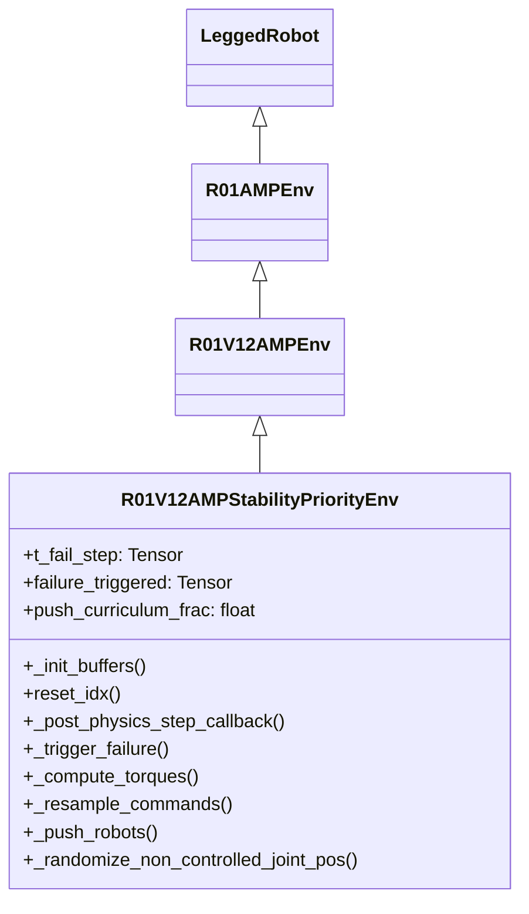
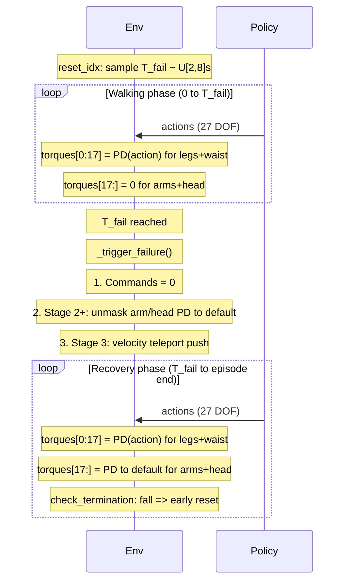

# Stability Priority Task Implementation Plan

## Architecture




New env class `R01V12AMPStabilityPriorityEnv` inherits from `R01V12AMPEnv`, overriding only the methods that need T_fail and curriculum behavior. Registered as the env for the stability priority task.

## Episode flow




## Files to create

### 1. New env: `[humanoid-gym/humanoid/envs/r01_amp/r01_v12_amp_stability_priority_env.py](humanoid-gym/humanoid/envs/r01_amp/r01_v12_amp_stability_priority_env.py)`

Inherits `R01V12AMPEnv`. Key overrides:

- `**_init_buffers()**`: Add per-env buffers:
  - `self.t_fail_step` (int tensor, per-env T_fail in sim steps)
  - `self.failure_triggered` (bool tensor, per-env flag)
  - `self.push_curriculum_frac = 0.0` (scalar, saved in checkpoint)
  - `self.controlled_joint_dim = self.leg_joint_dim + self.waist_joint_dim` (=17, boundary between policy-controlled and masked joints)
- `**reset_idx(env_ids)**`: After `super().reset_idx()`:
  - Sample `t_fail_step[env_ids]` = `uniform(t_fail_range[0], t_fail_range[1]) / self.dt`
  - Reset `failure_triggered[env_ids] = False`
- `**_post_physics_step_callback()**`: After `super()._post_physics_step_callback()`:
  - Check `newly_failed = ~failure_triggered & (episode_length_buf >= t_fail_step)`
  - Call `_trigger_failure(newly_failed_ids)` for any newly failed envs
- `**_trigger_failure(env_ids)**`:
  - Set `failure_triggered[env_ids] = True`
  - Zero commands: `self.commands[env_ids] = 0`
  - Set large `command_resample_timer` to prevent command resampling post-T_fail
  - Stage 3: apply one-time velocity teleport with curriculum-adjusted magnitude via direct root state velocity write (same mechanism as `_push_robots` but magnitude = `baseline + frac * (max - baseline)`)
- `**_compute_torques(actions)**`: Override the torque masking logic:
  - Before T_fail (per env): `torques[:, controlled_joint_dim:] = 0` (arms/head passive)
  - After T_fail, Stage 2+ (per env): `torques[:, controlled_joint_dim:] = p_gains * (default_dof_pos - dof_pos) - d_gains * dof_vel` for arm/head joints only (PD snap to default, ignoring policy action)
  - After T_fail, Stage 1: keep arms/head at zero torque (no PD snap in Stage 1)
- `**_resample_commands(env_ids)**`: Call `super()._resample_commands(env_ids)` but filter out `env_ids` where `failure_triggered` is True (prevent resampling after T_fail)
- `**_push_robots()**`: Override to apply push curriculum. Two options depending on design intent:
  - Option A: Disable periodic pushes entirely; only push at T_fail via `_trigger_failure`
  - Option B: Keep periodic pushes at parent magnitude during walking; T_fail push uses curriculum magnitude
  - **Recommendation: Option A** — Stages 1-2 have "no push," Stage 3 push is at T_fail only. Disable the base `_push_robots` by making it a no-op (or conditionally disable via config).
- `**_randomize_non_controlled_joint_pos(env_ids)`**: Override to use `controlled_joint_dim` (17) as the boundary instead of `leg_joint_dim` (12), so only arm/head joints are randomized at reset.
- **Push curriculum update**: In `_post_physics_step_callback` or `_trigger_failure`, update `push_curriculum_frac`:

```python
  if self.cfg.domain_rand.push_curriculum:
      self.push_curriculum_frac = min(1.0, self.common_step_counter / self.cfg.domain_rand.push_curriculum_end_steps)


```

  Log to extras: `self.extras["episode"]["push_curriculum_frac"] = self.push_curriculum_frac`

## Files to modify

### 2. Config: `[humanoid-gym/humanoid/envs/r01_amp/r01_v12_sa_amp_config_with_arms_and_head_full_scenes_stability_priority.py](humanoid-gym/humanoid/envs/r01_amp/r01_v12_sa_amp_config_with_arms_and_head_full_scenes_stability_priority.py)`

Changes to the `Cfg` class:

- `**env**`: Replace `leg_only_control = True` with `stability_curriculum_stage = 1` (controls which disturbances are active: 1=command zeroing, 2=+PD snap, 3=+push). Remove `leg_only_control`.
- `**env**`: Add `t_fail_range = [2.0, 8.0]`
- `**env**`: Add `episode_length_s = 13`
- `**domain_rand**`: Add push curriculum params:
  - `push_curriculum = True`
  - `push_curriculum_start_frac = 0.0`
  - `push_curriculum_end_steps = 96000`
  - `push_vel_baseline = 0.5`
  - `push_ang_baseline = 0.0`
- `**commands**`: Remove the entire `commands` class override. The parent's `amp_scene_tag_ratio = [0.1, 0.4, 0.2, 0.3]` already controls command sampling (the `new_sample_methods` overrides in this config are dead code because `amp_scene_tag_ratio` takes precedence in `_resample_commands`).
- `**rewards.scales**`: Update `torso_ang_vel_xy_penalty = 0.03` (from 0.002)

Changes to the `CfgPPO` class:

- `**runner**`: Add `max_iterations = 10000`

### 3. Checkpoint: `[humanoid-gym/humanoid/algo/amp_ppo/amp_on_policy_runner.py](humanoid-gym/humanoid/algo/amp_ppo/amp_on_policy_runner.py)`

- `**save()**` (~line 458): Add `"push_curriculum_frac": getattr(self.env, "push_curriculum_frac", None)` to the checkpoint dict
- `**load()**` (~line 507): Add `if hasattr(self.env, "push_curriculum_frac"): self.env.push_curriculum_frac = loaded_dict.get("push_curriculum_frac", 0.0)`

### 4. Registration: `[humanoid-gym/humanoid/envs/__init__.py](humanoid-gym/humanoid/envs/__init__.py)`

- Import new `R01V12AMPStabilityPriorityEnv`
- Update task registration (~line 214) to use `R01V12AMPStabilityPriorityEnv` instead of `R01V12AMPEnv`

## Key implementation detail: torque masking with per-env T_fail state

The `_compute_torques` override must handle per-env conditional masking since different envs may be in walking vs recovery phase simultaneously:

```python
def _compute_torques(self, actions):
    torques = super()._compute_torques_unmasked(actions)  # or inline PD computation

    # All envs: zero arm/head policy torques
    torques[:, self.controlled_joint_dim:] = 0.0

    # Stage 2+: envs past T_fail get PD to default for arm/head
    if self.cfg.env.stability_curriculum_stage >= 2:
        failed_mask = self.failure_triggered
        if failed_mask.any():
            arm_head_idx = slice(self.controlled_joint_dim, None)
            pd_torques = (self.p_gains[arm_head_idx] * (self.default_dof_pos[:, arm_head_idx] - self.dof_pos[:, arm_head_idx])
                         - self.d_gains[arm_head_idx] * self.dof_vel[:, arm_head_idx])
            torques[failed_mask, self.controlled_joint_dim:] = pd_torques[failed_mask]

    torques = torch.clip(torques, -self.torque_limits, self.torque_limits)
    return torques * self.motor_strengths
```

Note: The parent `_compute_torques` already includes `leg_only_control` masking and `torch.clip` + `motor_strengths`. The override must handle the full torque pipeline to avoid double-masking. The cleanest approach is to **duplicate the parent PD computation** in the override rather than calling `super()`, since the masking logic is fundamentally different.

## Important caveat: `amp_scene_tag_ratio` vs `new_sample_methods`

The parent config has `amp_scene_tag_ratio = [0.1, 0.4, 0.2, 0.3]` for `[stand, straight, turn, back]`. When this attribute exists, `_resample_commands` ignores `new_sample_methods` entirely. The stability priority config's `new_sample_methods` overrides (stand=0.80, etc.) are currently dead code. Removing the `commands` class override from the stability priority config is sufficient to get the parent distribution. The effective probabilities are stand=10%, straight=40%, turn=20%, back=30%.
