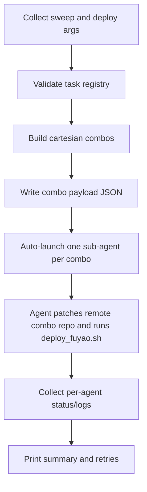

# Training Deployment Orchestrator Refactor

## Goal

Change orchestration to a strict split:

- `orchestrator.sh` only collects sweep input, expands Cartesian combinations, and auto-dispatches one sub-agent per combination.
- Each sub-agent performs actual submission by invoking remote-kernel `/root/.cursor/scripts/deploy_fuyao.sh` with fully populated arguments.

## Confirmed Decisions

- Dispatch mode: auto-dispatch via CLI runner (`cursor task` style).
- Submission target script: remote-kernel `/root/.cursor/scripts/deploy_fuyao.sh`.
- Orchestrator should not directly submit training jobs itself.

## Files To Update

- `/home/huh/.cursor/scripts/orchestrator.sh`
- `/home/huh/.cursor/scripts/deploy_fuyao.sh` (only if needed for argument parity/validation; submission remains in sub-agents)

## Implementation Steps

1. **Orchestrator role hardening**

- Keep interactive prompt collection for sweep metadata and deploy parameters.
- Keep task registration preflight (`envs/__init__.py`) and hyperparameter parsing.
- Remove direct job submission behavior from orchestrator execution path.

2. **Sub-agent payload builder**

- For each combo, construct a complete parameter payload (task, label, resources, queue/site/project/experiment, patch instructions).
- Serialize payload to per-combo JSON files under a run directory for traceability.

3. **Auto-dispatch adapter**

- Add a dispatcher in orchestrator that runs one CLI sub-agent invocation per combo (bounded parallelism).
- Each sub-agent receives only its combo payload and an execution template.
- Add fallback mode if CLI dispatcher is unavailable: emit executable command script(s) for manual run.

4. **Sub-agent execution contract**

- Sub-agent flow: prepare remote combo workspace, patch hard-coded params, run `/root/.cursor/scripts/deploy_fuyao.sh` with orchestrator-provided args, report status/log path.
- Preserve one-combo-per-agent isolation.

5. **Observability and failure handling**

- Per-agent stdout/stderr logs + status files.
- Final orchestrator summary: total, succeeded, failed, retry command for each failed combo.

## Data Flow

## Acceptance Criteria

- `orchestrator.sh` no longer directly submits jobs.
- One sub-agent is launched per hyperparameter combination.
- Each sub-agent invokes remote `/root/.cursor/scripts/deploy_fuyao.sh` using auto-filled parameters from orchestrator.
- Parallel dispatch is capped.
- Final run report includes per-combo result and retry guidance.
