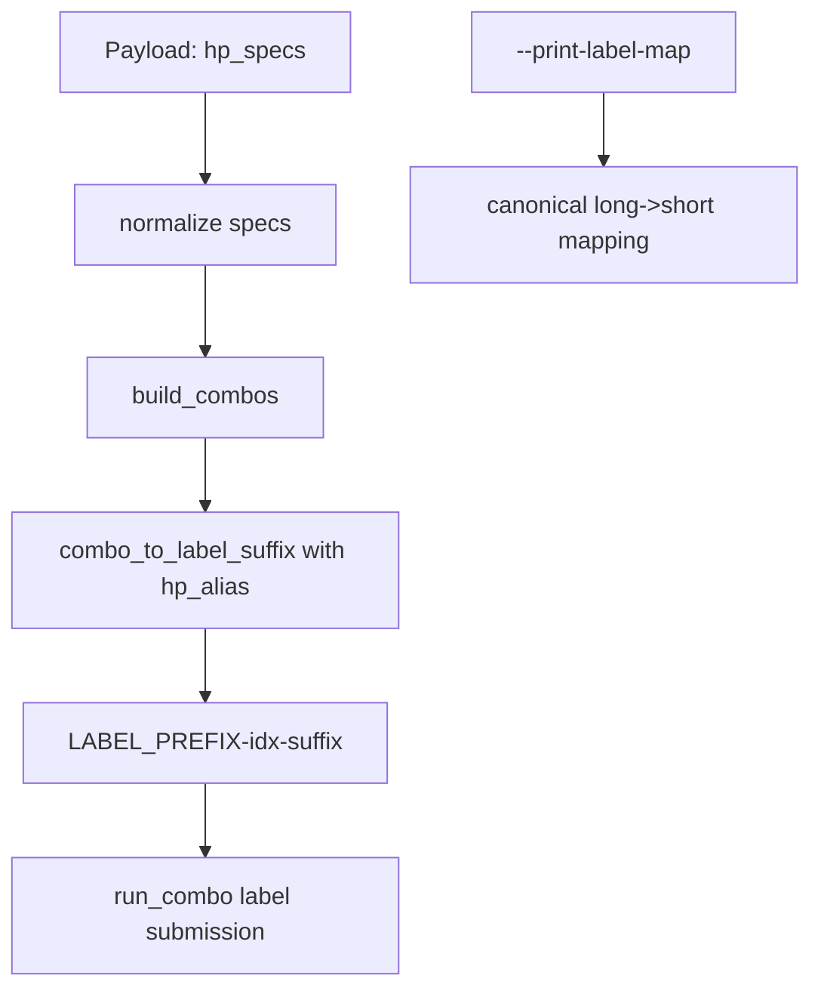

# Implement deterministic sweep label aliases for Fuyao sweep command

## Objective snapshot
- Goal: replace long parameter names in sweep job label suffixes with short deterministic aliases and keep full mapping discoverable.
- Constraint: preserve existing dispatch path (`deploy_fuyao_sweep_dispatcher.sh --payload <payload_file>`) and job launch behavior.
- Success criteria: existing sweep payloads still dispatch successfully, generated labels become short/consistent, and `--print-label-map` returns the canonical long-name to short-name map.

## Scope
- In scope:
  - [`/Users/HanHu/.cursor/scripts/deploy_fuyao_sweep_dispatcher.sh`]( /Users/HanHu/.cursor/scripts/deploy_fuyao_sweep_dispatcher.sh )
  - Optional command contract update: [`/Users/HanHu/.cursor/commands/sweep-fuyao.md`]( /Users/HanHu/.cursor/commands/sweep-fuyao.md )
- Out of scope:
  - [`/Users/HanHu/.cursor/scripts/orchestrator.sh`]( /Users/HanHu/.cursor/scripts/orchestrator.sh ) and [`/Users/HanHu/.cursor/scripts/orchestrator_parallel.sh`]( /Users/HanHu/.cursor/scripts/orchestrator_parallel.sh ) unless you later want label policy parity across all sweep tools.

## Current behavior (for reference)
- Input specs are normalized in `parse_hp_spec` and exploded in `build_combos`.
- Each combo label is currently built from escaped full combo text in `combo_to_label_suffix`.
- Label construction path: `combo_label="${LABEL_PREFIX}-$(printf "%04d" "$((idx + 1))")-$(combo_to_label_suffix "${combos[$idx]}")"`.
- This means labels currently include the full keys like `learning_rate` and `seed`.

## Proposed implementation
1) Add a canonical alias registry + fallback policy
- Introduce a deterministic `hp_alias()` helper near `combo_to_label_suffix` in `deploy_fuyao_sweep_dispatcher.sh`.
- Keep a fixed map of long names to readable short aliases (e.g. `learning_rate -> lr`, `entropy_coef -> ec`, `seed -> seed`, `num_steps_per_env -> nse`, etc.).
- For keys not in the map, apply a deterministic fallback: sanitize to lowercase/alphanumeric-underscore and truncate to a bounded width.
- Ensure deterministic collision handling for fallback aliases so two unknown keys cannot produce the same alias.

2) Rewrite label formatting to use aliases
- Update `combo_to_label_suffix` to:
  - split combo by `;`
  - split each piece by `=`
  - map each parameter key through `hp_alias`
  - sanitize value with existing escaping rules
  - reassemble as `<alias>_<value>` joined by `-`.
- Keep `combo_to_label_suffix` deterministic and side-effect free.
- Keep existing `--nodes`/`--gpus-per-node` and submit flow untouched.

3) Add deterministic map query CLI flag
- Extend usage text with `--print-label-map [--json]`.
- Add parser mode handling in `main` so this flag:
  - prints canonical alias map and fallback policy in stable order
  - exits before any git/SSH/payload checks.
- Keep output machine-friendly with one stable format (or optional `--json`) to make future agent lookup reliable.

4) Regression and consistency checks
- Add a small helper or one-off mode in `deploy_fuyao_sweep_dispatcher.sh` that:
  - prints sample expected labels from a fixed sample set such as `seed` + `learning_rate` combos.
  - verifies repeated derivation is identical (same input -> same suffix) in-process and exits with a clear result.
- Add a simple guard ensuring no duplicate suffix collisions for generated suffix list (for one run).

5) Optional discoverability update
- Document the new query flag and example short-name labels in [`sweep-fuyao.md`]( /Users/HanHu/.cursor/commands/sweep-fuyao.md ).

## Data flow

## Outliers and mitigations
- If no long-name map entry exists, fallback must be deterministic to avoid surprises across runs.
- A short alias could collide after truncation; a deterministic collision suffix avoids silent label duplication.
- Keep value escaping behavior stable so the new output remains CLI-safe and filesystem-safe.

