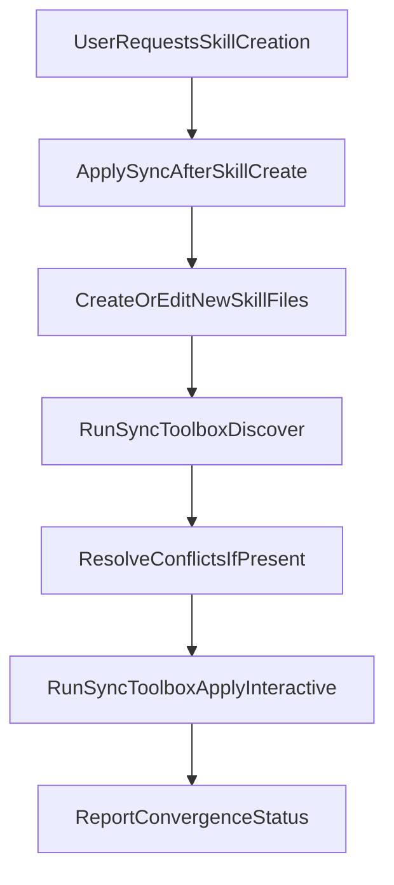

# Build `sync-after-skill-create` Skill

## Goal

Add a personal Cursor skill that is applied during skill-creation workflows and explicitly runs your existing `sync_toolbox` flow after creating or updating any skill files.

## Files To Add

- `[/Users/HanHu/.cursor/skills/sync-after-skill-create/SKILL.md](/Users/HanHu/.cursor/skills/sync-after-skill-create/SKILL.md)`

## Files To Reference

- `[/Users/HanHu/.cursor/scripts/sync_toolbox.sh](/Users/HanHu/.cursor/scripts/sync_toolbox.sh)`
- `[/Users/HanHu/.cursor/commands/sync-toolbox.md](/Users/HanHu/.cursor/commands/sync-toolbox.md)`
- `[/Users/HanHu/.cursor/skills-cursor/create-skill/SKILL.md](/Users/HanHu/.cursor/skills-cursor/create-skill/SKILL.md)`

## Implementation Steps

1. Create the new personal skill directory and `SKILL.md` with valid frontmatter:
  - `name: sync-after-skill-create`
  - description includes trigger terms like “create skill”, “new SKILL.md”, and “author skill”.
2. In the skill body, define the workflow:
  - Follow the normal skill-authoring process.
  - After writing any new or changed skill files, run:
    - `bash ~/.cursor/scripts/sync_toolbox.sh discover`
    - Resolve conflicts if any.
    - `bash ~/.cursor/scripts/sync_toolbox.sh apply --interactive`
  - Finish by reporting convergence status.
3. Add guardrails in the skill text:
  - If no skill files changed, skip sync.
  - If hosts are unreachable, continue and report skipped targets.
  - Do not hardcode host/IP data; rely on `~/.ssh/config` via existing script.
4. Keep wording concise so the skill is discoverable and can be auto-selected for future “create skill” requests.

## Validation

- Confirm the skill file is discoverable under `~/.cursor/skills/`.
- Dry test with a mock skill-creation request and verify the generated workflow includes calling `sync_toolbox`.
- Confirm output includes a short final sync status (conflicts/partial/identical/unreachable).

## Data Flow

