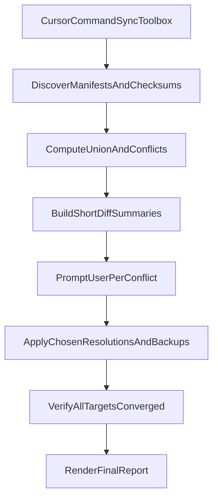

# Build `Sync Toolbox` User Command

## Goal

Create a global Cursor-invoked command that converges capability files across:

- local machine
- `huh.desktop.us` (your desktop host)
- `isaacgym` (container SSH target)
- `Huh8.remote_kernel.fuyao` (FUYA remote kernel target)

The command will sync:

- `~/.cursor/rules/`
- `~/.cursor/commands/`
- `~/.cursor/skills/`

## Target Files To Add

- `[/Users/HanHu/.cursor/commands/sync-toolbox.md](/Users/HanHu/.cursor/commands/sync-toolbox.md)`
- `[/Users/HanHu/.cursor/scripts/sync_toolbox.sh](/Users/HanHu/.cursor/scripts/sync_toolbox.sh)`
- `[/Users/HanHu/.cursor/scripts/sync_toolbox_diff_summary.py](/Users/HanHu/.cursor/scripts/sync_toolbox_diff_summary.py)`

## Implementation Plan

1. Add a global Cursor command markdown file that defines the `/sync-toolbox` workflow and explicitly tells Agent to run the helper script.
2. Implement a non-destructive discovery phase in shell script:
  - Validate SSH aliases in `~/.ssh/config`.
  - Collect file manifests and checksums for rules/commands/skills on each source.
  - Build a union file index across all sources.
3. Implement conflict detection:
  - Mark files as identical/missing/conflicting per source.
  - For each conflict, generate a short plain-English summary per source pair (max 5 bullets, max 10 words per bullet).
4. Implement interactive resolution protocol:
  - Prompt user in Cursor for each conflicting file.
  - Show concise source-by-source differences.
  - Ask user choice (keep source A/B/C/D, merge manually, or skip).
5. Implement sync/apply phase:
  - Create timestamped backups before overwriting.
  - Apply chosen resolutions.
  - Copy missing files so all targets converge.
  - Preserve permissions and directory structure.
6. Add final verification report:
  - Re-scan manifests.
  - Confirm all targets now match.
  - Print a compact success/failure summary by category and host.

## Data Flow

## Key Behavioral Defaults

- SSH aliases are read from `~/.ssh/config`; no hardcoded IPs.
- Conflict prompts are mandatory before conflicting overwrites.
- Difference text follows your format constraint:
  - plain English
  - up to 5 bullets per file
  - each bullet <= 10 words
- Non-conflicting additions sync automatically.
- Backups are created before destructive writes.

## Validation

- Dry-run mode shows planned actions without writing.
- Full-run mode verifies post-sync equivalence across all four environments.
- Handle unreachable hosts gracefully and continue with reachable ones while reporting skipped targets.

