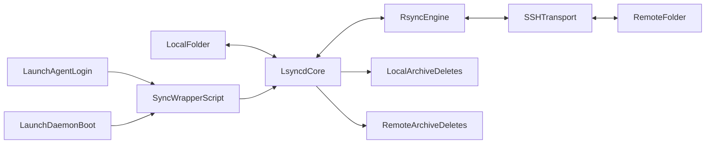

# Two-way SSH Sync on macOS

## Goal

Build a background sync service that keeps `/Users/HanHu/Documents/markdown` and `huh.desktop.us:/home/user/documents/markdown` synchronized in both directions, restarts automatically, and starts on both login and boot.

## Recommended approach

Use `lsyncd` for continuous filesystem-triggered sync in both directions, with:

- conflict policy: newest timestamp wins
- deletion policy: archive deleted files to a trash/archive path instead of hard delete
- a periodic fallback full sync to recover missed events

This is more reliable for near real-time sync than cron-only `rsync`, while still using `rsync` as the transfer engine.

## Files to create

- `[sync/config.env.example](sync/config.env.example)`
- `[sync/lsyncd.lua](sync/lsyncd.lua)`
- `[sync/bootstrap.sh](sync/bootstrap.sh)`
- `[sync/sync-wrapper.sh](sync/sync-wrapper.sh)`
- `[sync/README.md](sync/README.md)`
- `[launchd/com.hanhu.sync.user.plist](launchd/com.hanhu.sync.user.plist)`
- `[launchd/com.hanhu.sync.system.plist](launchd/com.hanhu.sync.system.plist)`

## Runtime design

## Implementation steps

1. Add env-template config with:
  - local path: `/Users/HanHu/Documents/markdown`
  - SSH host alias: `huh.desktop.us` (from local `~/.ssh/config`)
  - remote path: `/home/user/documents/markdown`
  - excludes and archive directories
2. Ensure remote destination exists before starting sync:
  - `ssh huh.desktop.us 'mkdir -p /home/user/documents/markdown'`
3. Implement `lsyncd.lua` with two sync blocks (local->remote and remote->local) using `rsync+ssh`.
4. Add delete-archive behavior by routing removes to archive locations (instead of direct deletion).
5. Enforce conflict policy by newest timestamp during sync operations.
6. Build wrapper and bootstrap scripts for dependency checks (`lsyncd`, `rsync`, `ssh`) and safe startup/restart.
7. Add launchd user agent for login autostart and launchd daemon for boot autostart.
8. Document install/uninstall, key setup, and verification workflow.

## Verification plan

- Dry-run initial sync both directions.
- Modify files on each side and verify newest edit wins.
- Delete files on each side and verify archived deletion behavior.
- Reboot and relogin; confirm service restarts and sync resumes.
- Simulate network loss and recovery; confirm automatic resume.

## Assumptions

- Remote host is reachable via SSH key auth.
- SSH alias `huh.desktop.us` already resolves correctly via local `~/.ssh/config`.
- macOS has permissions for filesystem watch and background launchd jobs.
- Boot-level job may run before user keychain unlock; user-level agent is primary for SSH-key reliability.

