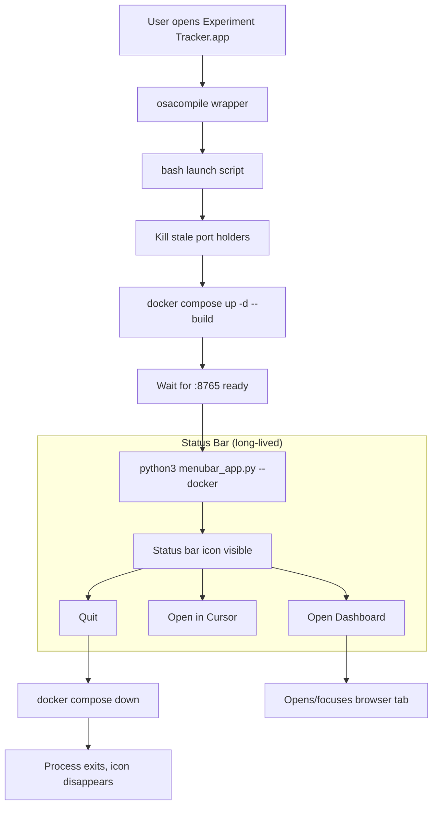

# Unified App Lifecycle via Status Bar

## Critique of the current fix

The port-clearing loop added to `launch` is a band-aid with four structural problems:

1. **Reactive, not preventive** -- it only kills stale processes on re-launch, not when they become stale.
2. **No shutdown path** -- Docker runs forever (`restart: unless-stopped`). There is no user-facing way to stop the dashboard short of running `docker compose down` manually.
3. **Invisible state** -- after launch the script exits; nothing shows the user that the dashboard is running. No status bar icon, no Dock presence.
4. **Two disconnected systems** -- [menubar_app.py](menubar_app.py) provides proper lifecycle (status bar + quit) but runs a local server. The [launch](Experiment Tracker.app/Contents/MacOS/launch) script uses Docker but has zero lifecycle management. They conflict on port 8765.

## Proposed architecture

The key change: the launch script no longer exits after starting Docker. It hands off to `menubar_app.py --docker`, which stays alive, shows the status bar icon, and owns the Docker container lifecycle.

## Changes

### 1. Add `--docker` mode to [menubar_app.py](menubar_app.py)

- Accept a `--docker` flag (and `--project-dir` for compose context)
- In Docker mode, skip starting the local `ThreadingHTTPServer` entirely
- `_quit()` runs `docker compose down --remove-orphans` before exiting
- `_start_server()` is replaced with a container-health check (poll `curl localhost:8765` or `docker inspect`)
- Keep "Open Dashboard", "Open in Cursor", and "Quit" menu items as-is
- Add a guard at startup: if another menubar instance is already running (check a PID file or port), just open the browser and exit instead of spawning a second icon

### 2. Modify [launch](Experiment Tracker.app/Contents/MacOS/launch)

- Remove the final browser-focus AppleScript block (the menubar app handles opening)
- After Docker is up and healthy, `exec python3 "$PROJECT_DIR/menubar_app.py" --docker --project-dir "$PROJECT_DIR"` so the launch script's process becomes the menubar app (long-lived)
- Keep the stale-port-killer and Docker startup logic as-is

### 3. Change [docker-compose.yml](docker-compose.yml) restart policy

Change `restart: unless-stopped` to `restart: "no"` so that quitting from the status bar actually stops the container permanently (instead of Docker auto-restarting it).

### 4. Duplicate-launch guard

When the app is opened a second time while already running:

- The launch script detects Docker is already up and the menubar app is already running (PID file at `$TMPDIR/exp-tracker-menubar.pid`)
- Instead of starting everything again, it just opens the browser to the dashboard URL and exits

### What "closing the browser" does

Auto-stopping on browser tab close is unreliable and surprising (user may reopen). Instead:

- The status bar icon is the single authoritative lifecycle control
- Closing the browser tab does nothing to the server -- this is standard behavior (like any dev server)
- The persistent status bar icon reminds the user the dashboard is still running
- Quit from the status bar stops Docker and removes the icon

